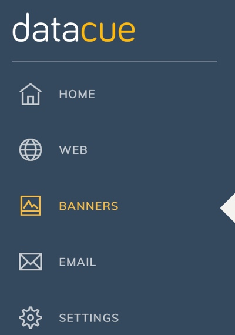

# Banners
Banners are the most prominent part of your home page. They are typically displayed immediately above the fold to attract users to a group of products. Typically these could be:
- Product categories (e.g. Jeans)
- Product brand
- Promotions on certain products

Due to their ability to attract attention, it's very important to show relevant banners to your visitors. Let's say a man visited your store and was looking at pants yesterday. When he returns today, we're better off showing him a banner on similar pants rather than our latest collection of dresses.

# Quick Start
- Setup your e-commerce store to show main and/or sub banners on your home page.
- Upload the banners you have using the dashboard.
- New banners will take a few hours to be processed and appear on your website.
    - Note: if you delete or update a banner, this change is applied immediately.

# Deeper Look

## Main or Sub
DataCue supports two types of banners, which we call main or sub.

**Main banners** are typically the large page wide banners that are displayed right at the top of a home page.

**Sub banners** are typically the smaller images that are displayed right at the top of a home page.

Some tips
- Don't worry if you have a different definition of main and sub banner. You can upload larger images as sub banners and smaller ones as main banners.
- You could choose to only use one type `main` or `sub`
- Ensure your banner sizes are consistent to avoid layout issues on your website. i.e. If your main banners should be 1280 x 400 px, then ensure all the banners you upload have the same size.

## Uploading a new banner
1. Click on 'Banners' in your dashboard sidebar

2. In the upload banner section, select the category you wish to associate with the banner.
    - We'll tell you which categories are the most popular sellers so you can prioritize
3. We'll automatically generate the link for you based on the category you selected, you can modify it if you want to
4. Drag and drop an image on to the striped box, or just click on it to browse for the banner image to upload it.

5. Click on Upload, thats it! You'll soon see your new banner appear in the existing banners section.
