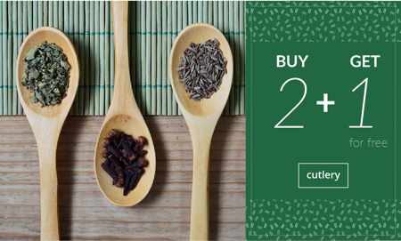
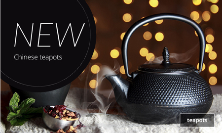
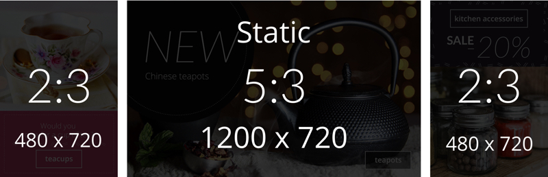
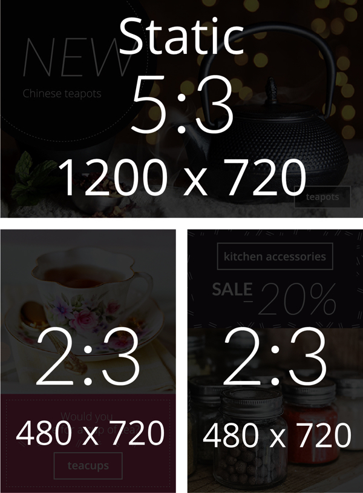
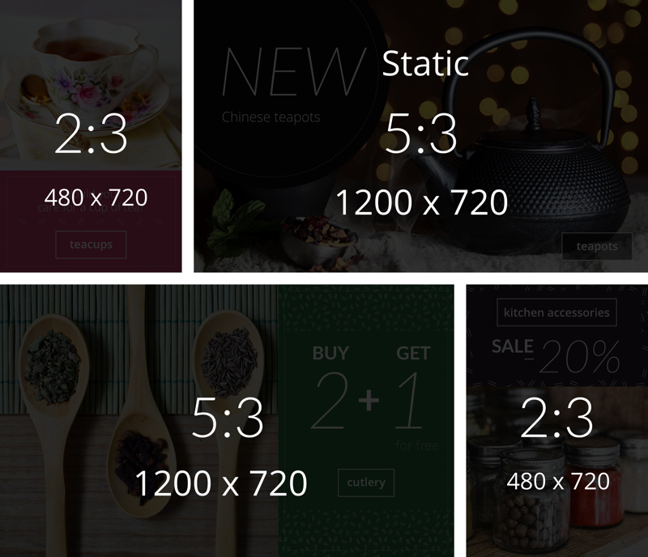
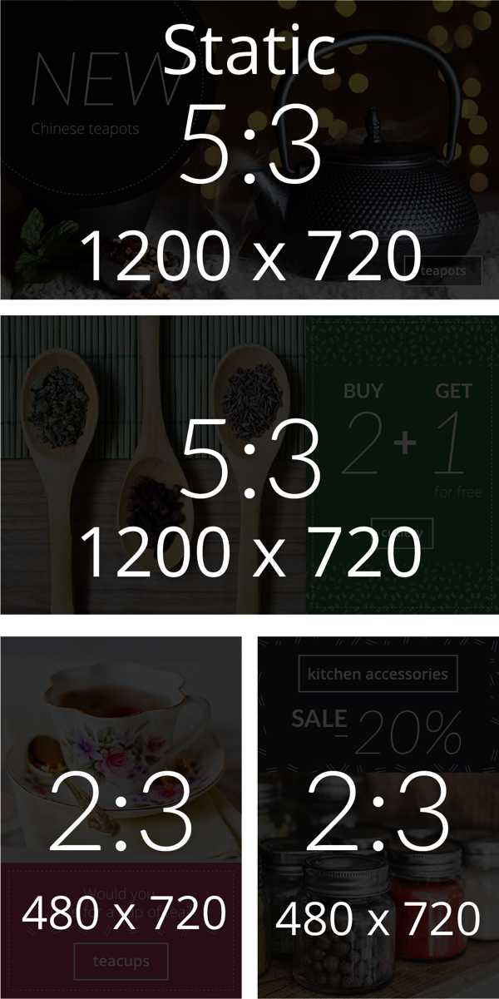
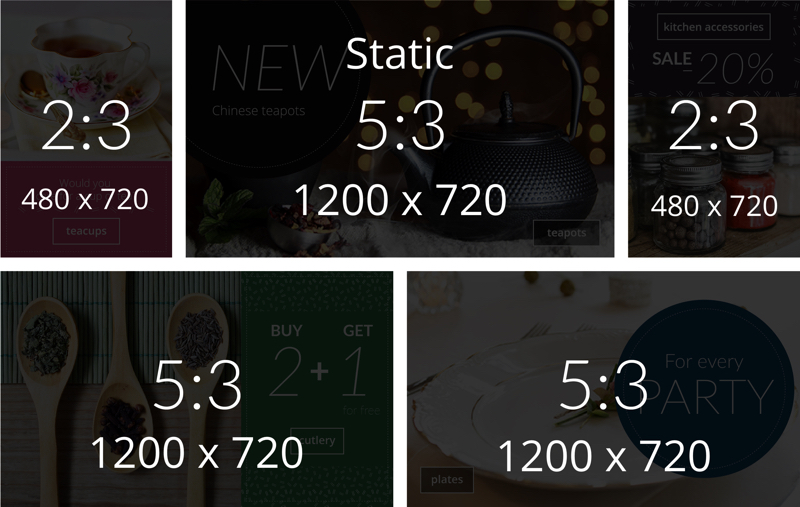
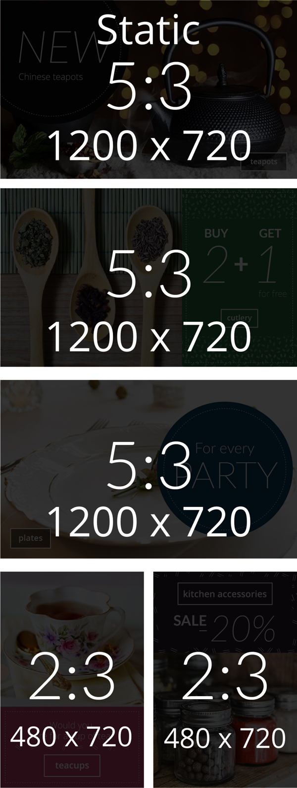
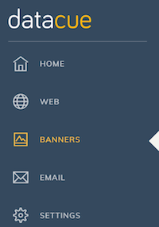
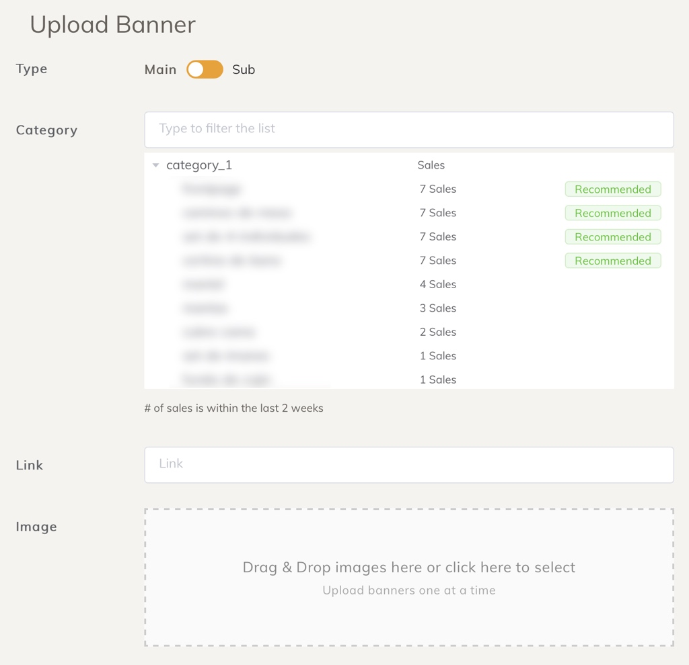

# Banners

Los banners son la parte más prominente de tu página de inicio. Por lo general, se muestran inmediatamente encima del pliegue para atraer a los usuarios a un grupo de productos. Típicamente estos podrían ser:

- Categorías de productos (por ejemplo: jeans)
- Marcas de productos.

Debido a su capacidad para atraer la atención, es muy importante mostrar banners relevantes a sus visitantes en lugar de mostrarles a todos lo mismo.

# Inicio rápido

1. Decida qué [layout](#layout-de-banner) prefiere.

2. Sube todos los banners que tienes actualmente.

3. Vea las recomendaciones del panel para decidir qué categorías priorizar qué banners crear.

::: tip CONSEJO
Si elimina o actualiza un banner, este cambio se aplica de inmediato.
:::

## Tipos de banner

DataCue soporta 3 tipos de banners:

1. Banner amplio
2. Banner estrecho
3. Banner estático

### Banner amiplio (relación de aspecto 5:3)

Los banners amiplios se utilizan para atraer la mayor atención, ya que son más grandes y brindan espacio para que uses elementos como texto estilizado para atraer la atención. Mostraremos las banners anchas de colecciones que el usuario encuentre más interesantes.

Tamaño recomendado: 1200 x 720 px

### Banner estrecho (relación de aspecto 2:3)

Las banners estrechos son un complemento de la pancarta ancha porque son más pequeñas. Después de seleccionar los banners amiplios, buscaremos todos los banners estrechos que el usuario encuentre interesantes.

Tamaño recomendado: 480 x 720 px

::: tip CONSEJO
Puede cargar un banner 'amiplio' y 'estrecho' para una categoría de producto. Nos aseguraremos de que ambos no aparezcan al mismo tiempo.
:::

Mostraremos los banners estrechos de las colecciones que el usuario encuentra más interesantes que aún no se muestran como un banner amiplio. Esto significa que los banners amiplios tienen prioridad.

### Banner estático

Los banners "estáticos" no son personalizados y seguirán siendo los mismos para todos. Utilícelo cuando desee promocionar un nuevo producto o hacer cualquier otro tipo de mensaje amplio con sus clientes.

## Layout de banner

Según la cantidad de colecciones que tenga, tenemos varios diseños de banner para elegir. Si conoce HTML + CSS, también puede hacer un diseño completamente personalizado y simplemente decirnos dónde insertar los banners personalizados.

Hemos realizado diseños para diferentes tamaños de tiendas en función de la cantidad de categorías de productos que tiene. Estas son solo sugerencias, por lo que si desea utilizar una categoría destinada a categorías de productos superiores/inferiores, no dude en probarlo.

### Pequeñas tiendas (10 o menos categorías de productos)

| Escritorio | Móvil |
| ------------------- | ------ |
|  |  |

### Tiendas medianas (10-20 categorías de productos)

| Escritorio | Móvil |
| ------------------- | ------ |
|  |  |

### Grandes tiendas (Mas de 20 categorías de productos)

| Escritorio | Móvil |
| ------------------- | ------ |
|  |  |

## Subiendo un nuevo banner

::: warning AVISO
El dashboard se está actualizando para reflejar la nueva solución de banner. Este documento se actualizará tan pronto como se actualice el dashboard.
:::

## Carga de un nuevo banner
1. Haga clic en 'Banners' en la barra lateral del dashboard

2. En la sección del banner de carga, seleccione la categoría que desea asociar con el banner.
    
    - Le diremos qué categorías son los vendedores más populares para que pueda priorizar

3. Generaremos automáticamente el enlace según la categoría que seleccionó, puede modificarlo si desea

4. Arrastre y suelte una imagen en el cuadro rayado, o simplemente haga clic en ella para buscar la imagen del banner y subirla.

5. Haga clic en `Cargar`, ¡eso es todo! Pronto verá aparecer su nuevo banner en la sección de banners existentes.
