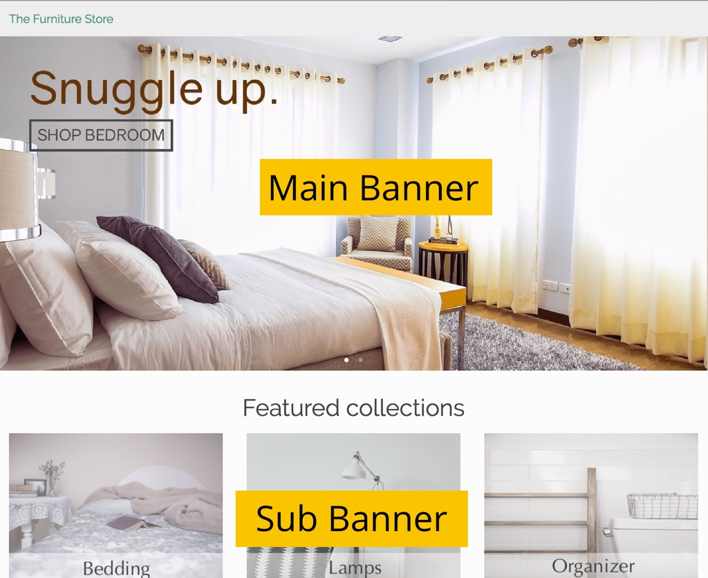

# Banners
Los banners son la parte más destacada de su página de inicio. Por lo general, se muestran inmediatamente arriba de la tapa para atraer a los usuarios a un grupo de productos. Por lo general, estos podrían ser:
- Categorías de productos (por ejemplo: Jeans)
- Producto de marca
- Promociones en ciertos productos

Debido a su capacidad para atraer la atención, es muy importante mostrar banners relevantes a sus visitantes. Digamos que un hombre visitó su tienda y estaba mirando pantalones ayer. Cuando regrese hoy, es mejor que le enseñemos una pancarta con pantalones similares en lugar de nuestra última colección de vestidos.

# Inicio rápido
- Configure su tienda de comercio electrónico para mostrar banners principales y / o secundarios en su página de inicio.
- Sube los banners que tienes usando el tablero.
- Los banners nuevos demorarán unas horas en procesarse y aparecer en su sitio web.
    - Nota: si elimina o actualiza un banner, este cambio se aplica inmediatamente.

# Mirada más profunda

## Principal o Sub
DataCue admite dos tipos de banners, que llamamos main o sub.

**Los banners principales** son típicamente los banners de gran tamaño que se muestran en la parte superior de una página de inicio.

**Los subtítulos** son típicamente las imágenes más pequeñas que se muestran en la parte superior de una página de inicio.

Algunos consejos
- No te preocupes si tienes una definición diferente de banner principal y secundario. Puede cargar imágenes más grandes como banners secundarios y banners más pequeños.
- Podrías elegir usar solo un tipo `main` o `sub`
- Asegúrese de que los tamaños de banner sean consistentes para evitar problemas de diseño en su sitio web. es decir, si sus pancartas principales deben ser de 1280 x 400 px, asegúrese de que todos los pancartas que suba tengan el mismo tamaño.

## Carga de un nuevo banner
1. Haga clic en 'Banners' en la barra lateral del tablero de instrumentos

2. En la sección del banner de carga, seleccione la categoría que desea asociar con el banner.
    - Le diremos qué categorías son los vendedores más populares para que pueda priorizar
3. Generaremos automáticamente el enlace según la categoría que seleccionó, puede modificarlo si desea
4. Arrastre y suelte una imagen en el cuadro rayado, o simplemente haga clic en ella para buscar la imagen del banner y subirla.

5. Haga clic en `Cargar`, ¡eso es todo! Pronto verá aparecer su nuevo banner en la sección de banners existentes.
