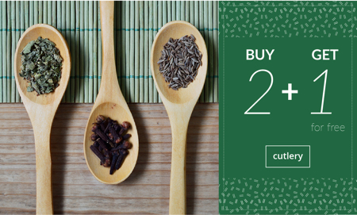
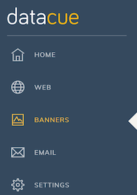

# Banners

Los banners son, probablemente, la parte que más resalta de tu página de Inicio. Por lo general, se muestran inmediatamente "above the fold" (en la parte principal), para atraer a los usuarios a un grupo de productos que hayas definido. Típicamente, estos serán colecciones agrupadas por:

- Categorías de productos (por ejemplo: "pantalones").
- Marcas de productos.

Debido a su capacidad para llamar la atención, es muy importante que muestres banners realmente relevantes a tus visitas. Después de todo, si tus usuarios son diferentes, ¿por qué les muestras lo mismo?Si no quieres desperdiciar este importante espacio de tu página de inicio, deja a DataCue el trabajo de seleccionar automáticamente qué banner atraerá mejor a cada usuario. Lograrás disminuir tu tasa de rebote y aumentar tiempos de permanencia en tu web. 

## Inicio rápido

1. Antes de comenzar, debes saber que DataCue funciona con grillas de banners, no con sliders. Primero, revisa los diferentes tamaños de banner soportados por DataCue. ¡Puedes crear tu propio estilo también!  
[Ir a Tipos de Banner](#tipos-de-banner).

2. Decide qué diseño o disposición de banners funciona mejor para tu sitio. Eres libre de pedirnos sugerencias si así lo deseas.  
[Ir al Disposición de Banners](#disposicion-de-banners)

3. ¿Ya tienes tus banners? Súbelos a tu plataforma DataCue.   
[Ir a Subir un Nuevo Banner](#subir-un-nuevo-banner)

<!-- 1. Si ya tienes tu cuenta DataCue activa, puedes ver las recomendaciones que hacemos en tu Panel de Control para decidir qué categorías priorizar y qué banners recomendamos crear .-->

## Tipos de banner
DataCue soporta 3 tipos de banners. Te los explicamos a continuación.

### Banner dinámico ancho

Los banners anchos se utilizan para atraer la mayor atención, porque son más grandes y brindan espacio para que uses más elementos. Mostraremos los banners anchos de las colecciones que el usuario encuentre más interesantes, de manera automática. Sabemos esto en base a señales de tu usuario, como los productos y categorías que visita, cuánto tiempo las visita, etc.

Relación de Aspecto Banner Ancho: **5:3**
Tamaño recomendado: **1200 x 720 px**

### Banner dinámico angosto 

Los banners angostos son más pequeños y nos permiten situarlos como un complemento al banner ancho. Después de seleccionar los banners anchos, en orden de relevancia buscaremos después todos los banners angostos que tu usuario pueda encontrar interesantes. Sí; los banners anchos tienen prioridad.

Relación de Aspecto Banner Angosto: **2:3**
Tamaño recomendado: **480 x 720 px**

::: tip Tip
¡Hey! Puedes cargar un banner 'ancho' y uno 'angosto' para una misma categoría de producto. Nos aseguraremos de que ambos no aparezcan al mismo tiempo ;)
:::

### Banner estático 

Entendemos que hay mensajes que quieres mantener uniformemente en tu sitio web. Por eso, creamos los banners estáticos. 

Los banners estáticos no son personalizados según el comportamiento de cada visita, sino que serán los mismos para todos. Utilízalos para mostrar nuevos lanzamientos, promociones especiales, o cualquier mensaje que quieres que todas tus visitas vean.

El banner estático será ancho. 
Relación de Aspecto estáticoo: **5:3** 
Tamaño recomendado: **1200 x 720 px**

## Disposición de banners

Hemos realizado diferentes "templates" o diseños determinados para que uses en tu web, en función de la cantidad de categorías de productos que tengas. Esto funciona solo a modo de sugerencia. Puedes elegir el diseño que más te guste, o crear el tuyo propio si sabes sobre HTML y CSS.

::: tip ¿Cuántas categorías de producto tienes?
Para DataCue, tu categoría o subcategoría es igual de importante. Si tu sitio tiene una familia de productos llamada "Alimento de Mascotas" y dentro de ella tienes 2 subcategorías, "Comida Perro" y "Comida Gato", para DataCue, tendrás 3 categorías.
:::

### 1. Baja variedad (10 o menos categorías)

| Escritorio | Móvil |
| ------------------- | ------ |
|  |  |

### 2. Media variedad (10-20 categorías)

| Escritorio | Móvil |
| ------------------- | ------ |
|  |  |

### 3. Alta variedad (20 o más categorías)

| Escritorio | Móvil |
| ------------------- | ------ |
|  |  |

### 4. Crea tu propio estilo

Puedes crear tu propio diseño para disponer tus banners [aquí](https://help.datacue.co/es/install/advanced.html).

## Sube tus banners dinámicos

Si subes un banner a tu Panel de Control DataCue, nuestro algoritmo podrá mostrarlo a los usuarios que más convenga. Es decir, será un banner dinámico. 

Para comenzar, sugerimos que crees idealmente 10 banners, para tus categorías y subcategorías más populares. Idealmente estas no serán muy amplias (por ejemplo, evita "Ofertas" o "Nuevos"); es mejor que sean más enfocadas en un grupo preciso de productos. Si lo deseas, también puedes crear banners para productos en particular.

Cuando tengamos datos de comportamiento de tus usuarios, podremos mostrarte el desempeño de tus banners. Sabrás qué tantos clicks y compras tiene cada uno, y cuáles conviene cambiar para asegurar que están logrando su objetivo. ¡Hurra! Ya no tendrás contenido que no apunte a mejorar tu conversión en tu sitio.

::: tip Tip
Cuando elimines o subas un banner, el cambio se reflejará en tu sitio en pocos minutos, si el proceso se realizó correctamente.
:::

1. Primero, en el menú izquierdo tu Panel de Control DataCue, haz click en 'Banners'.

    

2. Si seleccionas el botón "Añadir Banner", verás automáticamente tus categorías, como en la foto de abajo. Primero, la categoría con la cual quieras asociar la imagen. Verás qué categorías son las más populares, ¡te sugerimos crear banners para estas!

  

3. Generaremos automáticamente un enlace para la categoría que seleccionaste, en la parte de "link". Puedes modificarlo si lo deseas, para que sea el link correcto al que guiaremos a tu usuario cuando vea la imagen.

4. Arrastra y suelta una imagen en el cuadro, o simplemente haz click en el campo "Imagen" para buscar el archivo desde tu dispositivo. 

    **Nota**: El tamaño de banner (ancho o angosto) se seleccionará automáticamente si subes un archivo siguiendo nuestras [especificaciones](https://help.datacue.co/es/guide/banners.html#tipos-de-banner), a menos que estés subiendo un banner de tamaño personalizado. Para más información en tamaños personalizados, click [aquí](https://help.datacue.co/es/install/advanced.html). 

5. Haz click en `Cargar`. ¡Eso es todo! Pronto verás aparecer tu nuevo banner en tu sección de banners existentes, "Ancho" o "Angosto" según corresponda. Acá verás su desempeño una vez tengamos datos suficientes.
     

    
## Mide desempeño y prueba de banners

Muchas tiendas online pasan muchísimo tiempo diseñando sus elementos creativos, y organizando calendarios de contenido... sin saber si realmente ¡están trayendo resultados! 

DataCue es como un miembro más en tu equipo de marketing. Te permite ahorrar tiempo, al decidir por ti qué banner llamará mejor la atención de tu usuario. Cuando ingrese un usuario por primera vez al sitio (o por primera vez en mucho tiempo), verá automáticamente los más populares. ¡Ya no debes preocuparte de seguir tantos calendarios de planificación! 

Por otro lado, DataCue te permite tener contenido útil. Desde tu Panel de Control puedes ver qué tan efectivos son tus banners para la conversión, obtener recomendaciones de acciones a tomar, y realizar tests A/B para probar qué banner funciona mejor para una misma categoría o producto. Si vas a invertir tiempo en diseño, queremos que sea tiempo bien invertido.

**Para observar rendimiento de tus banners**

En el menú izquierdo de tu Panel, ve a la sección Banners. Inmediatamente verás tus banners ordenados por tamaño (Ancho o Angosto) si ya los subiste. 

- Puedes ordenar tus banners por Vistas, Clicks o Puntuación. La puntuación estará calculada en base a las conversiones del banner, es decir, compras a partir de clicks. 
- Verás íconos bajo el banner que serán recomendaciones a tomar, por ejemplo, cambiar un banner que no está desempeñándose bien. Sabrás cuáles son tus banners más exitosos en cada momento.

::: tip Tip
No solo obtendrás estos datos desde tu Panel de Control. Nos aseguraremos de que observes tu rendimiento, por lo que te enviaremos semanalmente un correo con tus banners y productos más y menos populares, y consejos para mejorar. 
:::