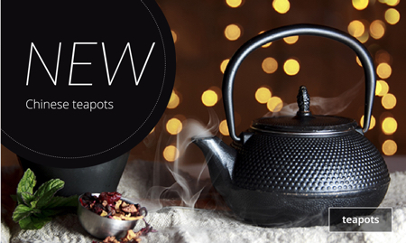
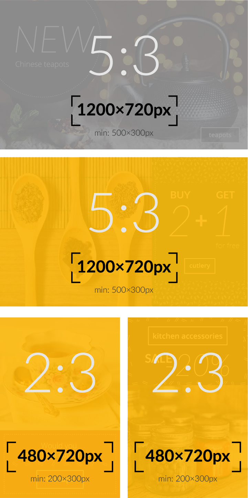
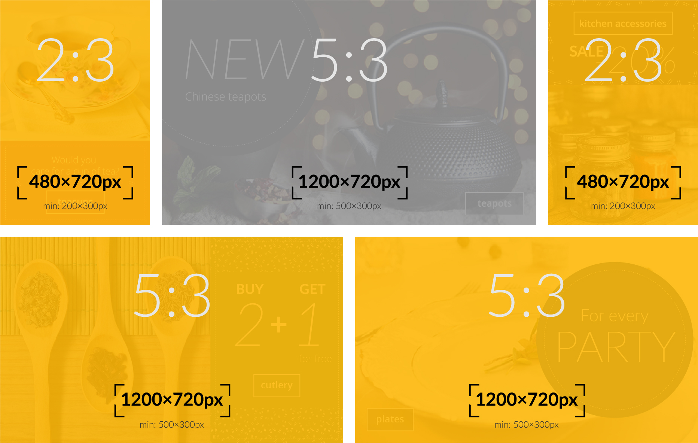

# Banners

Los banners son la parte más notoria de tu página de inicio. Por lo general, se muestran inmediatamente encima del pliegue (la zona the la página que requiere scrolling para ser vista) para atraer a los usuarios a un grupo de productos. Típicamente estos podrían ser:

- Categorías de productos (por ejemplo: jeans)
- Marcas de productos.

Debido a su capacidad para atraer la atención, es muy importante mostrar banners relevantes a tus visitantes en lugar de mostrarles a todos lo mismo.

## Inicio rápido

1. Antes de comenzar, revisa los diferentes tipos de banner soportados por DataCue.  
[Ir a Tipos de Banner](#tipos-de-banner).

1. Luego puedes decidir qué diseño funciona mejor para ti.  
[Ir al Disposición de Banners](#disposicion-de-banners)

1. Sube todos los banners.  
[Ir a Subir un Nuevo Banner](#subir-un-nuevo-banner)

<!-- 1. Vea las recomendaciones del panel para decidir qué categorías priorizar qué pancartas crear .-->

## Tipos de banner
DataCue soporta 3 tipos de banners explicados a continuación.

### Banner ancho (relación de aspecto 5:3)

Los banners amplios se utilizan para atraer la mayor atención ya que son más grandes y brindan espacio para que uses elementos como texto estilizado para atraer la atención. Mostraremos los banners anchos de colecciones que el usuario encuentre más interesantes.

Tamaño recomendado: **1200 x 720 px**

### Banner angosto (relación de aspecto 2:3)

Los banners angostos son un complemento al banner ancho porque son más pequeños. Después de seleccionar los banners anchos, buscaremos todos los banners angostos que el usuario encuentre interesantes.

Mostraremos los banners angostos de las colecciones que el usuario encuentra más interesantes que aún no se muestran como un banner ancho. Esto significa que los banners anchos tienen prioridad.

Tamaño recomendado: **480 x 720 px**

::: tip CONSEJO
Puedes cargar un banner 'ancho' y 'angosto' para una categoría de producto. Nos aseguraremos de que ambos no aparezcan al mismo tiempo.
:::

### Banner estático (relación de aspecto 5:3)

Los banners "estáticos" no son personalizados y seguirán siendo los mismos para todos. Utilízalo cuando desees promocionar un nuevo producto o hacer cualquier otro tipo de mensaje amplio con tus clientes.

Tamaño recomendado: **1200 x 720 px**

## Disposición de banners

Hemos realizado múltiples diseños para diferentes tamaños de tiendas en función de la cantidad de categorías de productos que tiene. Estos son solo una sugerencia, por lo que si quieres utilizar una categoría destinada a categorías de productos superiores / inferiores, no dudes en probarlo.

Si sabes HTML + CSS, también puedes hacer un diseño completamente personalizado e simplemente insertarlos usando la API.

### Bajo variedad de productos (10 o menos categorías de productos)

| Escritorio | Móvil |
| ------------------- | ------ |
|  |  |

### Medio variedad de productos (10-20 categorías de productos)

| Escritorio | Móvil |
| ------------------- | ------ |
|  |  |

### Alto variedad de productos (Mas de 20 categorías de productos)

| Escritorio | Móvil |
| ------------------- | ------ |
|  |  |

## Subir un nuevo banner

::: warning AVISO
El dashboard se está actualizando para reflejar la nueva solución de banner. Este documento se actualizará tan pronto como se actualice el dashboard.
:::

::: tip
Si eliminas o actualizas un banner, este cambio se aplica de inmediato.
:::
1. Haz clic en 'Banners' en la barra lateral del dashboard

    

2. En la sección del banner de carga, selecciona la categoría que deseas asociar con el banner.  

    **Nota**: Te diremos qué categorías son las vendedoras más populares para que puedas priorizar.

3. Generaremos automáticamente el enlace según la categoría que seleccionaste, puedes modificarlo si deseas.

4. Arrastra y suelta una imagen en el cuadro rayado, o simplemente haz clic en ella para buscar la imagen del banner y subirla.

    

5. Haz clic en `Cargar`, ¡eso es todo! Pronto verás aparecer tu nuevo banner en la sección de banners existentes.
    