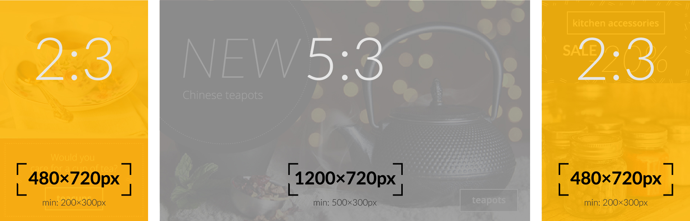
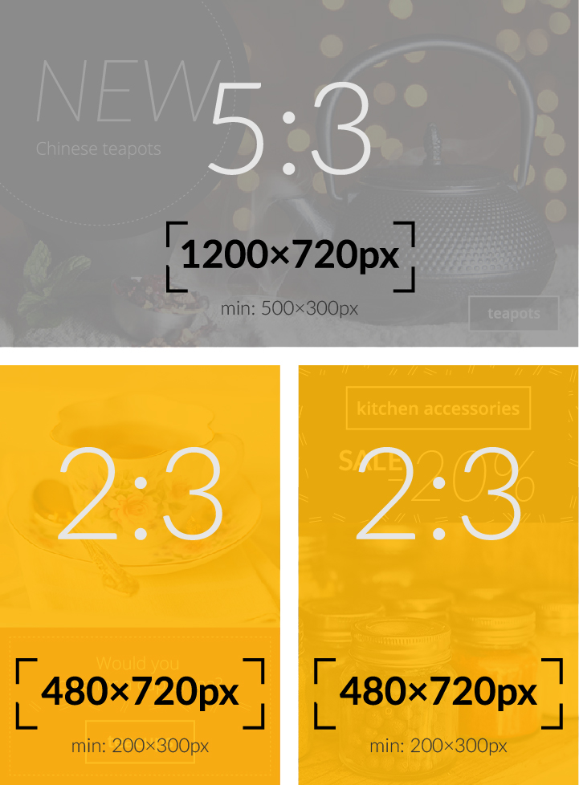

# Banners

Los banners son la parte que más resalta de tu página de inicio. Por lo general, se muestran inmediatamente encima del pliegue ("above the fold") para atraer a los usuarios a un grupo de productos. Típicamente, estos serán:

- Categorías de productos (por ejemplo: jeans)
- Marcas de productos.

Debido a su capacidad para atraer la atención, es muy importante mostrar banners relevantes a tus visitantes, en lugar de mostrarles a todos lo mismo. Seguro no quieres desperdiciar este importante espacio de tu página de inicio. 

## Inicio rápido

1. Antes de comenzar, revisa los diferentes tipos de banner soportados por DataCue.  
[Ir a Tipos de Banner](#tipos-de-banner).

1. Luego puedes decidir qué diseño funciona mejor para ti.  
[Ir al Disposición de Banners](#disposicion-de-banners)

1. Sube todos los banners.  
[Ir a Subir un Nuevo Banner](#subir-un-nuevo-banner)

<!-- 1. Ve las recomendaciones del panel para decidir qué categorías priorizar y qué banners conviene crear .-->

## Tipos de banner
DataCue soporta 3 tipos de banners. Te los explicamos a continuación.

### Banner ancho (relación de aspecto 5:3)

Los banners anchos se utilizan para atraer la mayor atención, porque son más grandes y brindan espacio para que uses más elementos, como texto estilizado. Mostraremos los banners anchos de las colecciones que el usuario encuentre más interesantes (sabemos esto en base a los productos y categorías que visita).

Tamaño recomendado: **1200 x 720 px**

### Banner angosto (relación de aspecto 2:3)

Los banners angostos son más pequeños y nos permiten situarlos como un complemento al banner ancho. Después de seleccionar los banners anchos, buscaremos todos los banners angostos que el usuario encuentre interesantes. Esto significa que los banners anchos tienen prioridad.

Tamaño recomendado: **480 x 720 px**

::: tip Tip
Puedes cargar un banner 'ancho' y uno 'angosto' para una categoría de producto. Nos aseguraremos de que ambos no aparezcan al mismo tiempo ;)
:::

### Banner estático (relación de aspecto 5:3)

Los banners "estáticos" no son personalizados según el comportamiento de cada visita, sino que serán los mismos para todos. Utilízalos para promocionar un nuevo producto o hacer llegar un mensaje relevante a tus clientes.

Tamaño recomendado: **1200 x 720 px**

## Disposición de los banners

Hemos realizado múltiples diseños, en función de la cantidad de categorías de productos que tiene cada tienda. Estos funciona solo a modo de sugerencia; tu puedes elegir el diseño que más te guste. 

Si sabes sobre HTML y CSS, también puedes hacer tu propio diseño completamente personalizado y simplemente insertarlo en tu sitio, usando la API.

### Baja variedad de productos (10 o menos categorías de productos)

| Escritorio | Móvil |
| ------------------- | ------ |
|  |  |

### Media variedad de productos (10-20 categorías de productos)

| Escritorio | Móvil |
| ------------------- | ------ |
|  |  |

### Alta variedad de productos (Mas de 20 categorías de productos)

| Escritorio | Móvil |
| ------------------- | ------ |
|  |  |

## Subir un nuevo banner

::: warning Aviso
El dashboard se está actualizando para reflejar la nueva solución de banner. Este documento se actualizará tan pronto como se actualice el dashboard.
:::

::: tip Tip
Si eliminas o actualizas un banner, el cambio se reflejará en tu sitio de inmediato.
:::
1. Haz click en 'Banners', en la barra izquierda de tu panel de control.

    

2. En la sección del banner de carga, selecciona la categoría que deseas asociar con el banner.  

    **Nota**: Te diremos qué banners recomendamos según tus categorías que más venden, para que puedas priorizar.

3. Generaremos automáticamente el enlace según la categoría que seleccionaste. Puedes modificarlo si deseas.

4. Arrastra y suelta una imagen en el cuadro, o simplemente haz click en ella para buscar la imagen desde tu dispositivo y subirla a nuestro panel.

    

5. Haz click en `Cargar`. ¡Eso es todo! Pronto verás aparecer tu nuevo banner en la sección de banners existentes.
    