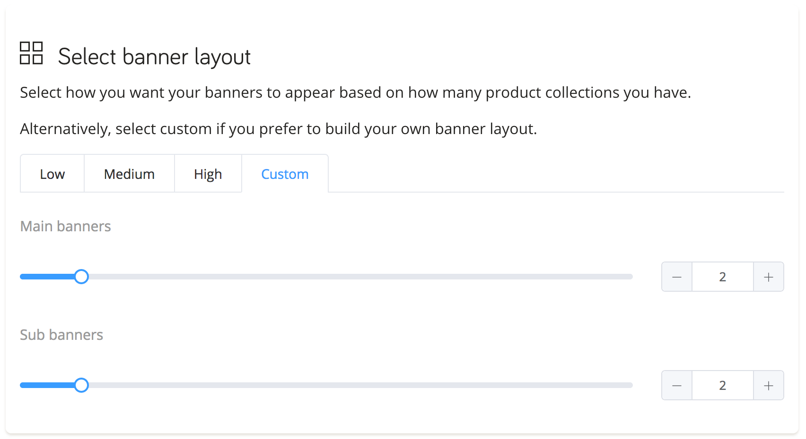

# Diseña tu propio estilo de banners

## Banners

¡Ahá! Has revisado nuestros templates prediseñados de banners, pero tienes ganas de algo diferente. Podemos crear justo ESO que estás pensando. 

DataCue permite tener dos tamaños de banners: les llamaremos banner principal ("main") y secundario ("sub"). Puedes elegir cualquier tamaño para cada uno, mientras seas consistente. Supongamos que hoy estás buscando un diseño así:


A esto nos referimos con ser consistente: todos los banners principales deben tener el mismo tamaño entre sí, y lo mismo aplica para los secundarios.

¡Manos a la obra!

::: tip Tip
Nuestros estilos prediseñados de banners han sido cuidadosamente probados y son 100% responsivos a móvil. Crear tu propio diseño significa que debes preocuparte de esto por ti mismo. 
:::

Esto es lo que debes hacer:

1. Crea tu diseño de grilla de banners, usando una combinación de dos tamaños de banner.

2. En tu dashboard, anda a Configuración de Banners (`Configuración > Banners`)

3. Elige `Personalizado` y selecciona la cantidad de banners que quieres tener. PAra el diseño de arriba, por ejemplo, serían dos Main y dos Sub. 

 

4. Inserta un pedacito de código HTML y dale estilo con CSS como se te ocurra.

```html
 <div class="custom-banners">
  <div class="custom-static">
    <a href="https://example.com/any-link-you-want">
      
    </a>
  </div>
  <div class="custom-big" data-dc-main-insert-banner="1"></div>
  <div class="custom-big" data-dc-main-insert-banner="2"></div>
  <div class="custom-small" data-dc-sub-insert-banner="1"></div>
  <div class="custom-small" data-dc-sub-insert-banner="2"></div>
 </div>
```
 
```css
 .custom-banners {
  display: grid;
  grid-gap: 1em;
  grid-template-rows: 1fr auto;
  grid-template-columns:
  fit-content(calc(25% - 0.5em)) 1fr 1fr fit-content(calc(25% - 0.5em));
  grid-auto-flow: row dense;
 }

 .custom-banners a img { vertical-align: bottom; }

 .custom-static { grid-row: 1; grid-column: 2 / span 2; }

 .custom-big { grid-row: span 2; }
```

El código de arriba es un ejemplo básico. La idea aplica para cualquier diseño. 

- Puedes usar cualquier nombre en la etiqueta de `div`. Ni siquiera es necesario que sean `div`s, puedes usar cualquier estructura que tengas y quieras adaptar.  

- El único requisito es que agregues el nombre correcto de atributo. Los banners principales deben tener `data-dc-main-insert-banner` y los secundarios, `data-dc-sub-insert-banner`. 

- Los números nos indican en qué orden insertamos los banners.

- Puedes saltarte la parte del banner estático si quieres que todos tus banners sean dinámicos, y cambien según comportamiento de tu usuario. Si quieres un banner que sea igual para todos, entonces, ten un banner estático. 

Si estás curioso y quieres conocer más detalles técnicos: nuestras recomendaciones son enviadas como una orden. Los números se refieren al orden en que enviamos cada elemento, comenzando por un 1 en lugar de un 0. 

```json
 {
  "main_banners": [
    { "link": "/collection/jeans", "photo_url": "jeans.jpg" },
    { "link": "/collection/tshirts", "photo_url": "tshirts.jpg" }
  ],
  "sub_banners": [
    { "link": "/collection/hats", "photo_url": "hats.jpg" },
    { "link": "/collection/shoes", "photo_url": "shoes.jpg" },
    { "link": "/collection/belts", "photo_url": "belts.jpg" },
    { "link": "/collection/chuck-norris","photo_url": "chuck-norris.jpg" }
  ]
 }
```

## Posición del ícono de Notificaciones

Nuestras notificaciones vienen en la forma de una campanita flotante. Puedes elegir su posición en tu sitio. O bien, puedes dejarla fija en tu barra de navegación, para que se vea más integrada. 

Inserta este HTML en tu barra de navegación, donde quieras poner este botón. Es posible que necesites un desarrollador que lo ayude a colocar la campana perfectamente.

```html
<style>
[data-dc-notification-button].has-unread::before {
  content: '';
  position: absolute;
  top: 2px; left: 2px;
  width: 8px; height: 8px;
  border-radius: 50%;
  background-color: #f42121;
}
[data-dc-notification-button] > svg {
  fill: black;
  width: 1.5rem;
}
</style>

<a href="#" data-dc-notification-button>
<svg id="datacue-notification-icon" data-name="Layer 1" xmlns="http://www.w3.org/2000/svg" viewBox="0 0 12 15"> <title>DataCue Notifications</title><path d="M11.38,11.22a2.19,2.19,0,0,1-.88-2V6.35A4.42,4.42,0,0,0,6,2,4.42,4.42,0,0,0,1.5,6.35V9.23a2.19,2.19,0,0,1-.88,2A1.26,1.26,0,0,0,0,12.32v0a1.23,1.23,0,0,0,1.26,1.22h9.48A1.23,1.23,0,0,0,12,12.35v0A1.26,1.26,0,0,0,11.38,11.22Z"/><path d="M7.05,1A1.05,1.05,0,0,0,5,1a1.05,1.05,0,0,0,2.1,0Z"/><path d="M6,15a2.26,2.26,0,0,0,1.84-.94H4.16A2.26,2.26,0,0,0,6,15Z"/>
</svg>
</a>
```

1. Para cambiar el color de la campana, reemplaza esta línea
  `fill: black;`
  con el código HEX del color que quieras. p.ej. `fill: #FF5733` para naranja.

2. Para cambiar el ícono, simplemente reemplaza la etiqueta `<svg>` con su propia imagen.

::: tip Tip
¿Eres desarrollador? Puedes darle la onda que quieras a esta campanita, con CSS
:::
