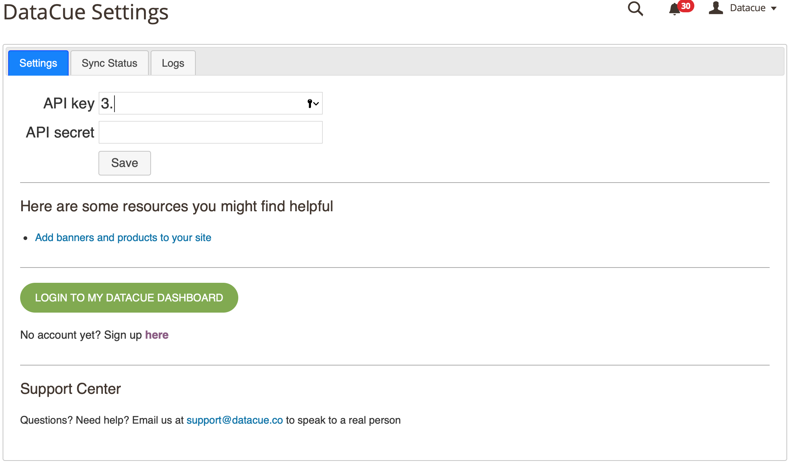

# Magento 2 <Badge text="beta" type="success"/>

Bienvenido a nuestra guía para instalar y usar DataCue en tu tienda Magento 2.

*¿*Confundido?**

Contáctanos usando el mail de soporte desde tu panel de control Magento 2, y te ayudaremos a que quedes listo. 

::: warning Advertencia
Esta extensión es solo apta para Magento 2. Usuarios en Magento 1 pueden referirse a nuestra [Documentación API](https://developer.datacue.co).
:::

## Instalación

### Antes de comenzar

Aquí hay algunos detalles que debes conocer antes de comenzar la instalación. 

- El módulo DataCue para Magento 2 requiere al menos la versión **Magento 2.3 o superior**.

- Por favor, prueba este plugin en un ambiente de Staging **antes** de instalar en tu servidor de producción. Los módulos o extensiones algunas veces se afectan entre sí, y lo último que quieres (creemos que es así) es descubrirlo en tu sitio en vivo. Idealmente, tu Staging será un clon de tu sitio de producción actual. 

- DataCue para Magento 2 sincronizará tus productos y pedidos, además de nombres y correos de tu usuarios.

- DataCue para Magento 2 instalará nuestra biblioteca Javascript en tu páginas de inicio, producto, categoría y de resultados. La biblioteca Javascript personalizará el contenido de tu sitio, según la actividad de cada visita online. 

Dependiendo de las leyes de privacidad de tu país, puede que debas solicitar permiso explícito de tu usuario para personalizar su contenido. Por favor, consulta los aspectos legales de tu zona si tienes dudas. 

### Instala la extensión

1. Ve a la raíz del directorio de instalación en Magento.

2. Corre los siguientes comandos. 

    ``` shell
    # setea Magento en su modo de mantenimiento 
    bin/magento maintenance:enable #si está en modo de producción
    # instala el módulo
    composer require datacue/magento_module
    # activa el módulo
    bin/magento module:enable --clear-static-content DataCue_MagentoModule
    bin/magento setup:upgrade
    bin/magento cache:clean
    bin/magento setup:di:compile
    ```

3. Pasos opcionales (¡pero recomendados!) 

    ``` shell
    # muestra contenido estático 
    bin/magento setup:static-content:deploy en_US #add all locales you're using here like es_CL

    # actualiza tus tablas de índice
    bin/magento indexer:reindex

    # evita conflictos en caché, con un flush
    bin/magento cache:flush
    ```

4. Comprueba que la instalación está OK. Desactiva el modo de mantenimiento. 

    ``` shell
    # Asegúrate de que el módulo esté activo. 
    bin/magento module:status DataCue_MagentoModule

    # Desactiva el módulo de mantenimiento 
    bin/magento maintenance:disable
    ```

5. Ingresa a tu panel de administrador de Magento 2. Encontrarás un link, llamado DataCue Settings, debajo de la sección de Marketing. Haz click en él.
    
    

6. Ingresa tu API key y API secret (encontrarás ambas en tu panel de control DataCue) y haz click en Guardar. 
    
    Dependiendo del tamaño de tu tienda, el proceso de sincronización variará entre unos pocos minutos y unas pocas horas. 

    :::tip Tip
    No tienes una cuenta DataCue? [Regístrate aquí](https://app.datacue.co/en/sign-up)
    :::

#### Soluciona problemas

El asunto más común que puede surgir se debe a permisos incorrectos. Asegúrate de que todas las carpetas importantes, como `generated`, `pub` y `vendor` tengan los mismos permisos que el usuario Magento. 


### Desactiva o desinstala el módulo 

Cuando desactivas y eliminas DataCue para Magento, removeremos todos los cambios hechos en tu tienda, incluyendo el Javascript. Adicionalmente, detendremos toda sincronización entre tu tienda y DataCue. 

Para desactivar DataCue de Magento 2, sigue estos pasos.

1. Ve a la raíz del directorio para Magento 2.

    ``` shell
    bin/magento module:disable --clear-static-content DataCue_MagentoModule

    bin/magento module:uninstall --clear-static-content DataCue_MagentoModule

    bin/magento setup:di:compile
    ```

2. You may need to change file permissions or ownership of the generated files after the uninstallation.

3. Confirm the module is now deleted.

    ```shell
    bin/magento module:status DataCue_MagentoModule
    ```

## Add recommendations

### Banners

1. Upload a fixed banner that all your visitors see. Make sure it has a publicly accessible URL, you'll need it later.

    If you're unsure, pick a banner to highlight your most popular collection or a promotion. Ensure the image has an aspect ratio of 5:3 (recommended size is 1200 x 720 px). Learn more about static banners [here](/banners).

2. Click `Content` on your left side bar.

3. Pick a `Block` thats in your home page, or directly go to your home page under `Pages`. Click on `Edit`.

4. Click on the `Insert Widget` button.

5. In widget type selector, choose `DataCue Banner`, fill in `Banner Image` with the URL from step 1 and enter the link for that banner under `Banner Link`.

6. Click `Insert Widget` and then save the current page or block.

7. You should see the banner image that you uploaded on your home page.

The default layout DataCue uses for your banners shows 2 dynamic banners and 1 static banner on one row. You can customize this by going to `Settings > Banners` in your DataCue dashboard. Read more about it [here](/banners/layout.html). 

Want to build your own custom layout? [read this](#custom-layout).

#### Changing your static banner later

1. Upload a new image to your server and copy the URL. Ensure the image has an aspect ratio of 5:3 (recommended size is 1200 x 720 px). Update the link for the static banner if necessary.

2. Edit the `block` or `page` where you inserted the banner widget. Edit the image URL to the new image you uploaded and and change the `link` to the banner as appropriate.

### Setup Product Recommendations

1. Click `Content` on your left side bar.

2. Pick a `Block` or `Page` corresponding to the page you want to insert the recommendations.

3. Click on the `Insert Widget` button and choose `Datacue Products`. Pick `All` and save your changes.

4. As soon as product recommendations are ready, you will start seeing them on your site.

### Match widgets to your theme

DataCue's product carousels have a default design which will need some adjustments to match the look/feel of your store. This is really important so nothing looks out of place.

#### Test mode

The first thing you should do is set DataCue into test mode. In test mode, you can pick a list of user accounts as test users. To see the recommendations, you have to sign in as a test user to your store. All other visitors don't see any changes. This is very helpful to play with the design till you're happy with the look/feel.

You will need to know a little CSS to match the design, so there are two options

**1. Let us help you (recommended)**

When you sign up, we'll get in touch with you and offer to help you with setting up your store.

**2. Do it yourself**

Feel free to reach out if you need any help.