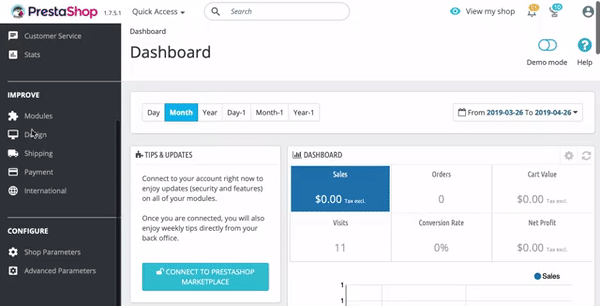

# PrestaShop <Badge text="private beta" type="success"/>

¡Bienvenido a nuestra guía sobre cómo instalar y usar DataCue en tu tienda PrestaShop! 

Si en algún paso estás confundido, contáctanos usando el mail de soporte desde tu panel de control PrestaShop, y te ayudaremos a que quedes listo. 

## Antes de empezar

Hay un par de cosas que debes saber antes de comenzar tu proceso de integración. 

- El módulo DataCue para PrestaShop requiere la versión **PrestaShop 1.7.4 o superior**.

- Por favor, prueba este plugin en un ambiente de prueba o "staging", **antes** de instalar en tu servidor de producción. Algunas veces los módulos peuden afectarse unos a otros, y no queremos descubrirlo en vivo en tu sitio web. Idealmente, tu zona de prueba será un clon de tu actual sitio web de producción. 

- DataCue para PrestaShop sincronizará tus productos, nombre y correo de tus clientes, y pedidos. Esta información es importante para que DataCue entienda el comportamiento de tus usuarios en línea. Esto es lo que ocurrirá cuando realices el paso 1 de nuestra Instalación (ver más abajo).

- DataCue para PrestaShop también isntala nuestra biblioteca de Javascript en tu página de inicio, páginas de producto y categoría, y página de búsquedas. Esta biblioteca Javascript personalizará el contenido de tu sitio para cada usuario que te visite. Esto es lo que ocurrirá cuando realices el paso 2 de nuestra Instalación.

- Dependiendo de las leyes de privacidad de tu país, puedes necesitar permiso explícito de parte de tu consumidor para aplicar personalización de contenido. Consulta con tus organismos legales si tienes dudas en la materia. 


## Paso 1: Instalando el módulo

1. Puedes descargar el instalador DataCue para PrestaShop en este [link](https://cdn.datacue.co/assets/integrations/datacue-prestashop-latest.zip). 

2. Instala el módulo desde tu panel de control de PrestaShop al hacer click en `Administración de módulos > Subir un módulo`. Selecciona el archivo ZIP del instalador DataCue. 

    

3. Una vez instalado, desplázate hacia abajo en la página para ver el módulo DataCue en "otros". 

4. Ingresa el usuario y clave de la API (API Key and Secret) proporcionados por DataCue. Presiona "guardar" para conectar tu tienda con DataCue. Encontrarás la Key y Secret en la primera pantalla cuando inicies sesión en tu [Panel de Control DataCue](https://app.datacue.co). 

    ::: tip Tip
    Si por algún motivo no ves tu Key y Secret de la API en esta pantalla, no te preocupes. Puedes acceder a ella al hacer click en el nombre de tu tienda web, arriba a la derecha, cuando seleccionas "Desarrollador" en el menú.
    :::
    
5. Dependiendo del tamaño de tu tienda, el proceso de sincronización tomará entre un par de minutos y unas pocas horas. Puedes hacer seguimiento al proceso al ir a la pestaña de "sincronización". 


## Paso 2: Agrega recomendaciones

### Banners

1. Selecciona el banner que quieras usar como "Banner estático", el que verán todos tus visitantes. Sube una imagen. Si no sabes cuál, anda a lo simple: tu colección más popular o una promoción del momento. Asegúrate de que la imagen tenga una relación de aspecto de 5:3 (tamaño recomendado es 1200 x 720 px). Aprende más de banners estáticos [aquí](/banners).

2. Inserta este HTML en tu documento de `index.tpl`:

    ```html
    <div
    data-dc-banners
    data-dc-static-img="path/to/your/banner.jpg"
    data-dc-static-link="link/to/chosen/category"
    ></div>
    ```

    Recuerda cambiar las URLs de `data-dc-static-img`  y `data-dc-static-link` de forma correcta.

    `static-img` es la URL de la imagen que subiste en el punto 1 (banner estático). 
    `static-link` es el link usado al que se envía el usuario cuando hace click en este banner. Pon una URL apropiada. Por lo general, es una página de categoría. 

3. El diseño que DataCue usa por defecto para los banners, muestra dos banners dinámicos y uno estático en una misma fila. Puedes cambiar esto si quieres, yenod a `Configuración > Banners` en tu panel de control DataCue. Lee más sobre esto [aquí](/banners/layout.html). Alternativamente, descubre cómo construir tu propia gilla de banners en [diseño personalizado](#custom-layout).

#### Cambia tu banner estático

1. Sube una nueva foto a tu servidor y copia su URL. Asegúrate de que la relación de aspecto de la imagen sea de 5:3 (tamaño recomendado 1200 x 720 px). Actualiza el link del banner estático si es necesario.

2. Edita tu documento `index.tpl` y encuentra el pedacito de código HTML de  `data-dc-banners` html. Copia la `static-img` a la URL que tomaste del paso 1. Configura el banner `estático-link según corresponda.

### Setear recomendaciones de producto

**Página de Inicio**

Inserta el siguiente HTML en tu documento `index.tpl`:

```html
<div data-dc-products></div>
```

**Página de Producto**

Inserta el siguiente HTML en tu documento `product.tpl`:

```html
<div data-dc-products></div>
```

## Paso 3: Adapta a tu estilo

Los carruseles de producto de DataCue vienen en un estilo determinado, por lo que querrás hacerle algunos ajustes para adaptarlo al estilo de tu tienda. ¡Esto es muy importante!, para que nada parezca fuera de lugar.

**Modo de prueba**

Lo primero que puedes hacer es setear DataCue en su Modo de Prueba. Este modo te permite tener una lista de usuarios que pueden ver cómo quedaría tu web usando DataCue, mientras el resto del público verá tu web como antes. Estos usuarios con permiso deben iniciar sesión en tu sitio para ver el modo de prueba. Los demás visitantes no verán ningún cambio. Esto te permite jugar con el diseño DataCue hasta que te parezca que está perfecto para salir en vivo. 

**Personaliza el diseño**

Tienes dos alternativas para esto. Primero, para ajustar al diseño de tu tienda de manera básica, cuentas con una amigable herramienta que estará disponible en tu panel de control DataCue. Puedes acceder a ella en la sección Configuración > Productos.

Segundo, si lo que quieres es realizar cambios avanzados, puedes hacer los ajustes que necesites con CSS. 


## Deshabilita o desinstala el módulo 

Cuando deshabilitas o desinstalas el módulo DataCue en PrestaShop, todos los cambios hechos en tu tienda serán removidos, incluyendo el Javascript. A la vez, termina la sincronización de cualquier dato de tu tienda con DataCue.

Para deshabilitar DataCue para PrestaShop:

- Inicia sesión en tu panel de administrador PrestaShop.

- En el panel de navegación izquierdo, haz click en `Administración de Módulos`, y desliza hacia abajo en la página hasta ver el módulo DataCue.

- Selecciona el menú a la derecha del módulo, y elige Desinstalar o Deshabilitar. ¡Listo!


**¿Dudas?**

¡[Contáctanos](https://datacue.co/contact) si necesitas apoyo! 