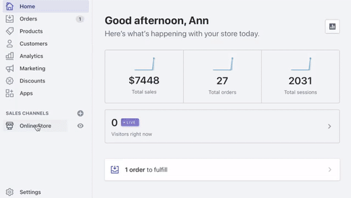
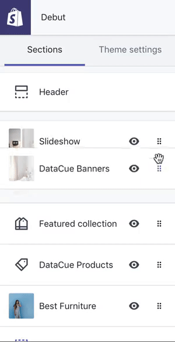
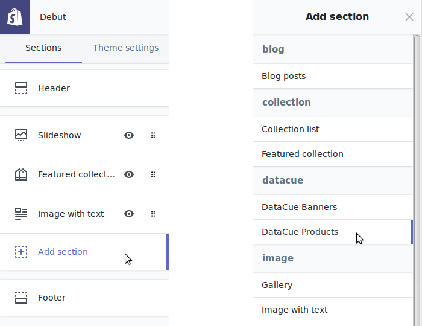

# Shopify

¡Bienvenido a nuestra guía sobre cómo instalar y usar DataCue en tu tienda Shopify!

**¿Confundido?**

Contáctanos usando el correo de soporte de tu app de Shopify y estaremos felices de ayudarte a comenzar. 

## Instala la app

Lo primero es lo primero. Si aún no lo has hecho, instala la aplicación DataCue en Shopify.

Haz click [aquí](https://apps.shopify.com/datacue) para comenzar la instalación desde la app store de Shopify.

## Agrega recomendaciones inteligentes

### Inicio rápido: Banners dinámicos y recomendaciones en tu página de inicio



### Configura tus Banners (Planes Growth o Pro) 

1. Haz click en "Tienda Online" en tu menú lateral
    

2. Haz click en "Personalizar" para ir al editor de Temas. 

    

3. Haz click en "Añadir sección", y agrega la sección llamada "DataCue Banners" 

    

4. Elige la imagen del que será tu banner estático (se mostrará a todos tus usuarios, independiente de su comportamiento). Haz click en "Seleccionar Imagen" y súbela. Idealmente, será una imagen que refleje tus colecciones más populares, o una promoción del momento. Asegúrate de que la imagen tenga una relación de aspecto de 5:3 (el tamaño recomendado es 1200 x 720 px). Aprende un poco más sobre banners estáticos [aquí](/banners).

   

5. Haz click en el botón para ir atrás. Puedes arrastrar la sección de Banners que recién agregaste, a la posición deseada. Te recomendamos dejarla justo bajo tu barra de navegación. Puedes ocultar secciones que ya no usarás, como sliders antiguos.

    

6. Guarda tus cambios

7. El diseño por defecto de banners DataCue considera dos banners dinámicos y un banner estático, en una misma fila. Puedes personalizar este diseño al ir a `Banners > Configuración` en tu panel de control DataCue. Lee más sobre nuestros diseños [aquí](/banners/layout.html). Alternativamente, puedes querer [construir tu propio diseño](#custom-layout).

#### Modificando tu banner estático

1. PAra esto, anda a las configuraciones de DataCue Banners en tu panel de administrador Shopify (`Tienda online > Personalizar tema > DataCue Banners`).

2. Click en el botón de 'seleccionar imagen' y sube una nueva imagen. Nuevamente, asegúrate de mantener la relación de aspecto 5:3 (tamaño recomendado es 1200 x 720 px). Actualiza el link al que llegará el banner estático, si es necesario. 

### Configura recomendaciones de producto (Todos los planes)

**Página de Inicio**

1. Anda al editor de temas (`Inicio / Personalizar tema / Personalizar`).

   

2. Click en "añadir sección", y encuentra la categoría "Datacue". Elige "Productos DataCue".

   

3. Arrastra esta sección recién agregada a la posición donde quieras ver este carrusel de productos. 
    

4. Guarda tus cambios. ¡Estás listo!

**Páginas de Producto**

La mayoría de los temas no permiten agregar secciones personalizadas a páginas de producto; pero puedes hacerlo manualmente. 

Si estás familiarizado con editar temas, sabes que puedes encontrar el template de la página de producto en (`templates/product.liquid`), en el editor de código:


Pega este código especial al final del template, allí donde quieras ver las recomendaciones de producto DataCue:

```html
<div data-dc-products></div>
```


**Elige posiciones avanzadas**

Puedes querer poner nuestros carruseles de recomendaciones de producto en distintas partes de tu página de producto. Modifica un poco el código para decirnos qué tipo de recomendación quieres, e insértalo en la posición deseada. 

Productos relacionados

```html
`<div data-dc-products="related"></div>`
```

Productos similares

```html
`<div data-dc-products="similar"></div>`
```

Productos recientemente vistos

```html
`<div data-dc-products="recent"></div>`
```

### Adapta a tu estilo

Los carruseles de producto DataCue vienen con un dseño por defecto, que puedes querer cambiar para que se asemeje al look de tu sitio. Esto es muy importante, pues la idea es que nada parezca fuera de lugar. 

**Modo de prueba**

Lo primero que debes hacer ahora es poner DataCue en su modo de prueba. Esto te permite elegir una lsita de cuentas (usuarios) que verán las recomendaciones DataCue, mientras el resto de tus visitas no verán cambios aún. Para ver las recomendaciones, los usuarios de prueba deben iniciar sesión en tu sitio. Esto es muy útil para que juegues con el diseño, hasta que sientas que tu sitio está listo para salir en vivo. 

Necesitarás saber un poco de CSS para adaptar el diseño. Tienes dos opciones.

**1. Te podemos ayudar (recomendado)**

Cuando te registres en DataCue, nos contactaremos contigo. Te preguntaremos si quieres ayuda para setear tu tienda con DataCue. ¡Toma nuestra oferta!

**2. Hazlo tú mism@**

¡Cool! Adelante. Hemos creado un archivo llamado datacue_custom.css, en tu editor de temas. Puedes agregar todos los estilos que quieras ahí y quedarán separados de otros estilos de código de tu tienda. Si necesitas ayuda o tienes dudas, contáctanos. 
