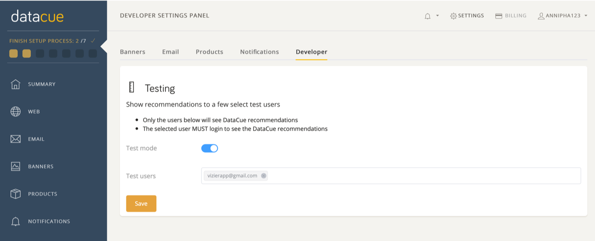
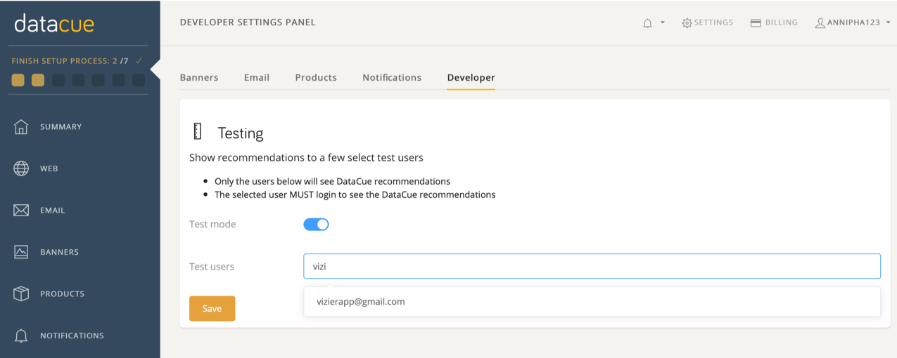

# Modo de prueba

## Establecer DataCue en su modo de prueba

Lo primero que debes hacer después de descargar DataCue, es configurarlo en Modo de prueba. ¡Deja este modo hasta que estés satisfech@ con el diseño!

1. Haga click [aquí](https://app.datacue.co) para iniciar sesión en tu Panel de Control.

2. En el Panel de Control, anda a la configuración, en la esquina superior derecha.

3. Haz click en la pestaña "Desarrollador".

4. Activa el modo de prueba.

   

## Seleccionar usuarios de prueba

Una vez que las recomendaciones estén listas y después de haber agregado el carrusel de recomendaciones de producto DataCue, puedes comenzar a verlas. ¡Emocionante!

Para hacer esto, solo necesitas seleccionar una lista de correos electrónicos que serán tus usuarios de prueba. Solo ellos verán el contenido DataCue mientras estés en modo Prueba. Simplemente escribe el correo electrónico del usuario de prueba y el resto, lo haremos por ti.

Para ver las recomendaciones, deberás iniciar sesión como usuario de prueba en tu tienda. Todos los demás visitantes no verán ningún cambio.
