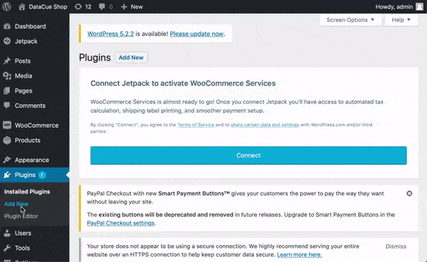
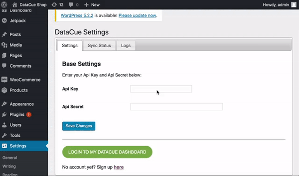

# WooCommerce <Badge text="beta" type="warn"/>

¡Bienvenido a nuestra guía sobre cómo instalar y usar DataCue en tu tienda WooCommerce!

**¿Confundido?**

Contáctanos usando el correo de soporte de tu panel de WooCommerce y estaremos felices de ayudarte a comenzar. 

## Instalación

### Antes de comenzar

Aquí hay un par de cosas que debes saber antes de instalar el plugin. 

- Debes tener el plugin de WooCommerce instalado y activo en WordPress.

- Tu servidor debe cumplir con los requerimientos mínimos de WooCommerce, incluyendo PHP 7.0 o superior.

- Por favor, prueba este plugin DataCue en un ambiente de prueba o "staging", **antes** de instalar en tus servidores de producción. Los plugins a veces se afectan entre sí, y no queremos descubrirlo en tu sitio web en vivo. Idealmente tu sitio de prueba será un clon de tu sitio de producción. 

- Plugins de almacenamiento caché pueden interferir con este proceso de sincronización. Te recomendamos **apagarlos** antes de la instalación, hasta que esta se haya completado. 

- DataCue para WooCommerce sincronizará tu catálogo de productos, nombre y correo de tus clientes, y tus pedidos. 

- DataCue para WooCommerce instalará nuestra biblioteca de Javascript en tus páginas de inicio, producto, categoría y búsquedas. Esta biblioteca Javascript personalizará el contenido de tu sitio para cada usuario que te visite. 

Dependiendo de las leyes de privacidad de tu país, puedes necesitar permiso explícito de parte de tu consumidor para aplicar personalización de contenido. Consulta con tus organismos legales si tienes dudas en la materia. 


### Instalando el plugin

1. Descarga el plugin

    <Button link="https://cdn.datacue.co/assets/integrations/datacue-woocommerce-latest.zip" text="Download"/>

    ::: tip Consejo
    Safari en Mac OS X puede expandir automáticamente tu archivo ZIP a una carpeta. Si es el caso, puedse preferir usar otro navegador. O bien, puedes deshabilitar la opción `Abrir archivos "seguros" tras la descarga`  en tus preferencias de Safari.
    :::

2. Instala el plugin desde tu panel de control de administrador en WordPress / WooCommerce. Haz clcik en `Plugins > Agregar nuevo > Subir plugin > Elegir archivo`. Selecciona la carpeta ZIP que descargaste y haz click en "instalar ahora".

    

3. Una vez instalado, selecciona "Activar Plugin"

4. Ingresa tu Key y Secret de la API DataCue. Haz click en "guardar" para conectar tu tienda con DataCue. Encontrarás tu Key y Secret de la API en la primera pantalla cuando inicias sesión en tu [Panel de control DataCue](https://app.datacue.co). 

    

    ::: tip Consejo
    Si por algún motivo no ves tu Key y Secret de la API en esta pantalla, no te preocupes. Puedes acceder a ella al hacer click en el nombre de tu tienda web, arriba a la derecha, cuando seleccionas "Desarrollador" en el menú.
    :::

    
5. Dependiendo del tamaño de tu tienda, el proceso de sincronización tomará entre un par de minutos y unas pocas horas. Puedes hacer seguimiento al proceso al ir a la pestaña de "sincronización". 

### Desactiva o borra el plugin

Cuando deshabilitas DataCue para WooCommerce, todos los cambios hechos en tu tienda serán removidos, incluyendo el Javascript. A la vez, termina la sincronización de cualquier dato de tu tienda con DataCue.


Para desactivar DataCue para WooCommerce, sigue estos pasos.

- Inicia sesión en tu panel de administrador WordPress.

- En el panel de navegación izquierdo, haz click en Plugins. Elige Plugins instalados.

- Haz click en el botón al lado del plugin DataCue para WooCommerce. Haz click en Desactivar.

- Una vez desactivas el plugin, tienes también la opción de eliminarlo. 

::: tip Consejo
Si ves que por error, el plugin sigue activo, lo más probable es que tengas corriendo un plugin de almacenamiento caché. Desactiva el caché y actualiza. Luego, borra el plugin nuevamente.
:::

## Agrega recomendaciones

DataCue usa "códigos cortos" para ayudarte a agregar rápidamente banners dinámicos y recomendaciones de producto a tu sitio, sin requerir saber programar. Si quieres saber más, revisa [aquí (wordpress.com).](https://en.support.wordpress.com/shortcodes/)

::: tip Consejo
¿Sabías que WooCommerce es un plugin para WordPress? Gran parte de las funcionalidades que ofrece WordPress pueden usarse en WooCommerce, como códigos cortos. 
:::


### Banners (Planes Growth y Pro)

1. Elige una imagen que usarás como "banner estático", que verán todos tus usuarios por igual. Desde tu panel de control WooCommerce, anda a `Media > Agregar nuevo`, y elige esta imagen. Si no sabes cuál banner elegir, te vas a la segura poniendo alguna categoría o colección popular. O bien, una promoción. Asegúrate de que la relación de aspecto sea 5:3 (el tamaño recomendado es 1200 x 720 px). Aprende más sobre banners estáticos [aquí](/banners).

2. Click on the newly uploaded image in your "Media Library" and copy the URL. You'll need this for the next step.

3. From your Dashboard click on "Pages" and open your Home page. Insert the code snippet below right after your navigation bar. 

    Remember to change the urls for `static-img`  and `static-link` correctly.

    `static-img` is the URL you got from the previous.
    `static-link` is the link to send the user when they click on the banner. Set an appropriate URL for your store, typically a category page.

    ```
    [datacue-banners static-img="/path/to/img.jpg" static-link="/link/to/category"]
    ```

4. The default layout DataCue uses for your banners shows 2 dynamic banners and 1 static banner on one row. You can customize this by going to `Banners > Settings` in your DataCue dashboard. Read more about it [here](/banners/layout.html). Alternatively, find out how to build your own [custom layout](#custom-layout).

#### Changing your static banner later

1. Upload a new image to your WordPress media library and copy the URL. Ensure the image has an aspect ratio of 5:3 (recommended size is 1200 x 720 px). Update the link for the static banner if necessary.

2. Go to "Pages" and edit your Home page.

3. Find the datacue banners short code and change the `static-img` to the URL you copied from step 1. Set the `static-link` attribute as appropriate.

### Setup Product Recommendations (All plans)

**Home page**

1. Go to the page editor and select your Home page.

2. Edit the code and add the product recommendations shortcode to where you want it.

    ```
    [datacue-products]
    ```

3. Save your changes and you're done!

**Product page**

Customizing your product page requires editing of your theme PHP files. 
If you're familiar with theme editing, you can find the product page template here: `plugins\woocommerce\templates\single-product\product-image.php`

add the PHP code where you want to see the product recommendations.

```php
<?php echo do_shortcode( '[datacue-products]' ); ?>
```

### Match widgets to your theme

DataCue's product carousels have a default design which will need some adjustments to match the look/feel of your store. This is really important so nothing looks out of place.

**Test mode**

The first thing you should do is set DataCue into test mode. In test mode, you can pick a list of user accounts as test users. To see the recommendations, you have to sign in as a test user to your store. All other visitors don't see any changes. This is very helpful to play with the design till you're happy with the look/feel.

You will need to know a little CSS to match the design, so there are two options

**1. Let us help you (recommended)**

When you sign up, we'll get in touch with you and offer to help you with setting up your store.

**2. Do it yourself**

Feel free to reach out if you need any help.
