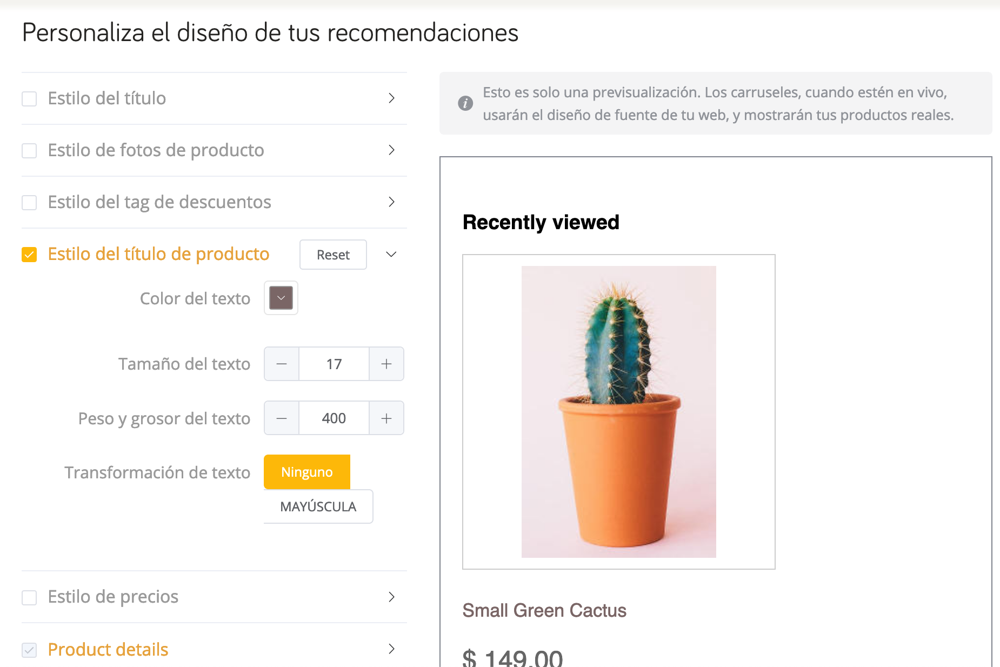

# WooCommerce <Badge text="beta" type="success"/>

Bienvenido a nuestra guía sobre cómo instalar y usar DataCue en tu tienda WooCommerce. ¡Wooohoo!

**¿Confundido?**

Contáctanos usando el correo de soporte de tu panel de WooCommerce y estaremos felices de ayudarte a comenzar. 

## Instalación

### Antes de comenzar

Aquí hay un par de cosas que debes saber antes de instalar el plugin.

- Debes tener el **plugin de WooCommerce instalado y activo en WordPress**.

- Tu servidor debe cumplir con los requerimientos mínimos de WooCommerce, incluyendo **PHP 7.0 o superior**.

- Por favor, prueba este plugin DataCue en un ambiente de prueba o "staging", **antes** de instalar en tus servidores de producción. Los plugins a veces se afectan entre sí, y no queremos descubrirlo en tu sitio web en vivo. Idealmente tu sitio de prueba será un clon de tu sitio de producción. 

- Plugins de almacenamiento caché pueden interferir con este proceso de sincronización. Te recomendamos **apagarlos** antes de la instalación, hasta que esta se haya completado. 

- DataCue para WooCommerce sincronizará tu catálogo de productos, nombre y correo de tus clientes, y tus pedidos. Esto es lo que ocurrirá cuando realices el paso 1 de nuestra Instalación (ver más abajo).

- DataCue para WooCommerce instalará nuestra biblioteca de Javascript en tus páginas de inicio, producto, categoría y búsquedas. Esta biblioteca Javascript personalizará el contenido de tu sitio para cada usuario que te visite. Esto es lo que ocurrirá cuando realices el paso 2 de nuestra Instalación.

- Dependiendo de las leyes de privacidad de tu país, puedes necesitar permiso explícito de parte de tu consumidor para aplicar personalización de contenido. Consulta con tus organismos legales si tienes dudas en la materia. 


## Paso 1: Instala el plugin

1. Descarga el Plugin

    <Button link="https://cdn.datacue.co/assets/integrations/datacue-woocommerce-latest.zip" text="Download"/>

    ::: tip Tip
    Safari en Mac OS X puede expandir automáticamente tu archivo ZIP a una carpeta. Si es el caso, puedse preferir usar otro navegador. O bien, puedes deshabilitar la opción `Abrir archivos "seguros" tras la descarga`  en tus preferencias de Safari.
    :::

2. Instala el plugin desde tu panel de control de administrador en WordPress / WooCommerce. Haz clcik en `Plugins > Agregar nuevo > Subir plugin > Elegir archivo`. Selecciona la carpeta ZIP que descargaste y haz click en "instalar ahora".

    

3. Una vez instalado, selecciona "Activar Plugin".

4. Ingresa tu usuario y contraseña (Key y Secret) de la API DataCue. Haz click en "guardar" para conectar tu tienda con DataCue. Encontrarás tu Key y Secret de la API en la primera pantalla cuando inicies sesión en tu [Panel de control DataCue](https://app.datacue.co). 

    

    ::: tip Tip
    Si por algún motivo no ves tu Clave y Secreto de la API en esta pantalla, no te preocupes. Puedes acceder a ella, yendo a `Configuración > Desarrollador` arriba en tu panel de control de DataCue
    :::

5. Dependiendo del tamaño de tu tienda, el proceso de sincronización tomará entre un par de minutos y unas pocas horas. Puedes hacer seguimiento al proceso al ir a la pestaña de "sincronización". 


## Paso 2: Agrega recomendaciones

DataCue usa "códigos cortos" para ayudarte a agregar rápidamente banners dinámicos y recomendaciones de producto a tu sitio, sin requerir saber programar. Si quieres saber más, revisa [aquí (wordpress.com).](https://en.support.wordpress.com/shortcodes/)

::: tip Tip
OK, en realidad no es un tip, ya sabes que WooCommerce es un plugin para WordPress... Por eso, gran parte de las funcionalidades que ofrece WordPress pueden usarse en WooCommerce, como códigos cortos. 
:::

### Banners

1. Elige una imagen que usarás como "banner estático", que verán todos tus usuarios por igual. Desde tu panel de control WooCommerce, anda a `Media > Agregar nuevo`, y elige esta imagen. Si no sabes qué banner elegir, te vas a la segura poniendo alguna categoría o colección popular. O bien, una promoción. Asegúrate de que la relación de aspecto sea 5:3 (el tamaño recomendado es 1200 x 720 px). Aprende más sobre banners estáticos [aquí](/banners).

2. Haz click en la recién subida imagen en tu "Bilbioteca Multimedia" y copia su URL. La necesitarás en el siguiente paso. 

3. Desde tu panel de control, haz click en "Páginas" y abre tu página de inicio. Inserta el pedazo de código que te mostramos acá, justo debajo de tu barra de navegación. 

    Recuerda cambiar las URL de `static-img` y `static-link` correctamente.

    `static-img` es la URL que copiaste del banner en paso 2. 
    `static-link` es el link al cual enviarás al usuario una vez que haga click en este banenr. Por lo general, este link es una página de categoría.

    ```
    [datacue-banners static-img="/path/to/img.jpg" static-link="/link/to/category"]
    ```

4. El diseño por defecto que DataCue usa para tus banners, incluye dos banners dinámicos y un banner estático, en una sola fila. Puedes personalizar esto al ir a tu panel de control DataCue, sección `Configuración > Banners`. Lee más sobre esto [aquí](/banners/layout.html). O bien, construye desde cero tu [propio diseño](#custom-layout).

#### Modifica tu banner estático 

1. Cuando quieras cambiar tu banner estático, puedes subir la imagen deseada a tu biblioteca multimedia en WordPress y copia la URL de imagen. Recuerda que esta imagen tenga una relación de aspecto de 5:3 (y ojalá tamaño 1200 x 720 px). Refresca el link de la página de categoría o producto según sea necesario. 

2. Ve a sección "Páginas" y edita tu Página de Inicio. 

3. Encuentra el código corto de los banners DataCue y cambia la `static-img` por la URL de imagen que copiaste en el paso 1. Configura el `static-link` como corresponda.

### Configura recomendaciones de producto

#### Página de inicio

1. Ve al editor de páginas y selecciona tu página de Inicio. 

2. Edita el código y agrega el código corto de Recomendaciones de Producto al sitio donde quieras agregar estos carruseles. 

    ```
    [datacue-products]
    ```

3. Guarda tus cambios. ¡Listo!

#### Página de producto y otras páginas

```php
<?php echo do_shortcode( '[datacue-products]' ); ?>
```

Incluye el código PHP de arriba para agregar recomendaciones de producto a la siguientes páginas:

1. Página de producto
2. Página de categoría
3. Página de búsqueda
4. Página de carrito
5. Página de Error 404

El tipo de recomendación de producto que verás en cada página, lo puedes activar o desactivar desde tu panel de control DataCue.

Ejemplo: Tal vez solo quieres mostrar "Productos recientemente vistos" en tu página de error 404, pero en otra página, activar "Productos Similares" y "Relacionados". ¡Todo esto lo haces con solo unos clicks!

## Paso 3: Adapta el estilo a tu tema

Los carruseles de producto DataCue vienen con un diseño por defecto, que puedes querer cambiar para que se asemeje al look de tu sitio. Esto es muy importante, pues la idea es que nada parezca fuera de lugar.

### Modo de prueba

Lo primero que debes hacer ahora es poner DataCue en su modo de prueba. Esto te permite elegir una lista de cuentas (usuarios) que verán las recomendaciones DataCue, mientras el resto de tus visitas no verá cambios aún. Para ver las recomendaciones, los usuarios de prueba deberán iniciar sesión en tu sitio.

Esto es muy útil para que juegues con el diseño, hasta que sientas que tu sitio está listo para salir en vivo. Para aprender a configurar DataCue en modo de prueba, haz clic en [aquí](/es/install/testmode.html#establecer-datacue-en-modo-de-prueba)

### Personaliza el diseño

Tienes dos alternativas para esto:

#### 1. Una amigable herramienta para ajustar al diseño

Puedes ajustar al diseño de tu tienda facilmente con una amigable herramienta. Puedes acceder a ella en tu panel de control DataCue en la sección `Configuración > Productos`.



#### 2. CSS para cambios avanzados

Si lo que quieres es realizar cambios avanzados, puedes hacer los ajustes que necesites con CSS.

## Desactiva o elimina el plugin

Cuando deshabilitas DataCue para WooCommerce, todos los cambios hechos en tu tienda serán removidos, incluyendo el Javascript. A la vez, termina la sincronización de cualquier dato de tu tienda con DataCue.


Para desactivar DataCue para WooCommerce, sigue estos pasos.

- Inicia sesión en tu panel de administrador WordPress.

- En el panel de navegación izquierdo, haz click en Plugins. Elige Plugins instalados.

- Haz click en el botón al lado del plugin DataCue para WooCommerce. Haz click en Desactivar.

- Una vez desactivas el plugin, tienes también la opción de eliminarlo. 

::: tip Tip
Si ves que por error, el plugin sigue activo, lo más probable es que tengas corriendo un plugin de almacenamiento caché. Desactiva el caché y actualiza. Luego, borra el plugin nuevamente.
:::

**¿Dudas?**

Si tienes preguntas o comentarios respecto a este editor de diseño, ¡no dudes en hacérnoslas saber!

