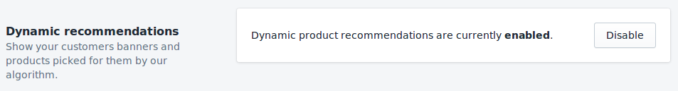

# Banners

Los banners son la parte más notoria de tu página de inicio. Por lo general, se muestran inmediatamente encima del pliegue (la zona the la página que requiere scrolling para ser vista) para atraer a los usuarios a un grupo de productos. Típicamente estos podrían ser:

- Categorías de productos (por ejemplo: jeans)
- Marcas de productos.

Debido a su capacidad para atraer la atención, es muy importante mostrar banners relevantes a tus visitantes en lugar de mostrarles a todos lo mismo.

## Inicio Rápido

1. Sigue las instrucciones en [la guía de banners del dashboard](/es/dashboard/banners.html) para seleccionar el diseño y cargar tus primeros banners.

2. Una vez que tengas instalada la aplicación Shopify DataCue, ve a la configuración de la aplicación y habilita las recomendaciones.

    

3. Ingresa al editor de temas para agregar una nueva sección.

4. Busca la categoría "datacue" y selecciona "DataCue Banners".

5. Elige o carga un banner estático y hazlo apuntar a algún lado. Este será mostrado a todos los visitantes.

   

6. Arrastra la sección recién agregada donde deseas que aparezcan los banners.

7. ¡Guarda tus cambios y listo!
