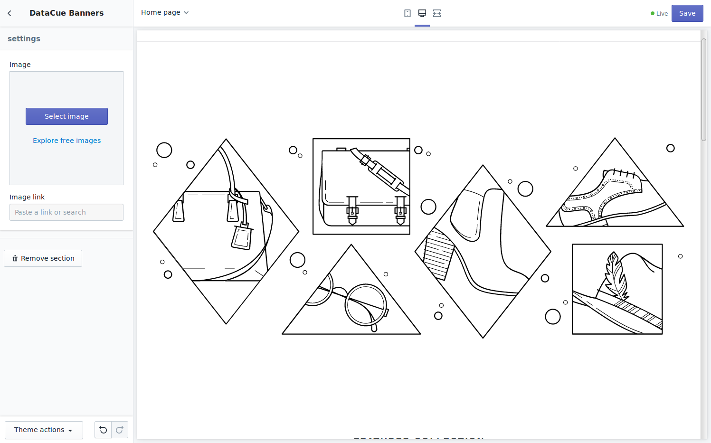
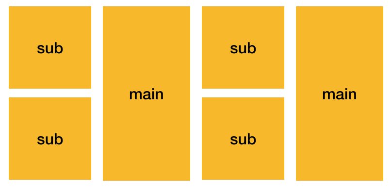
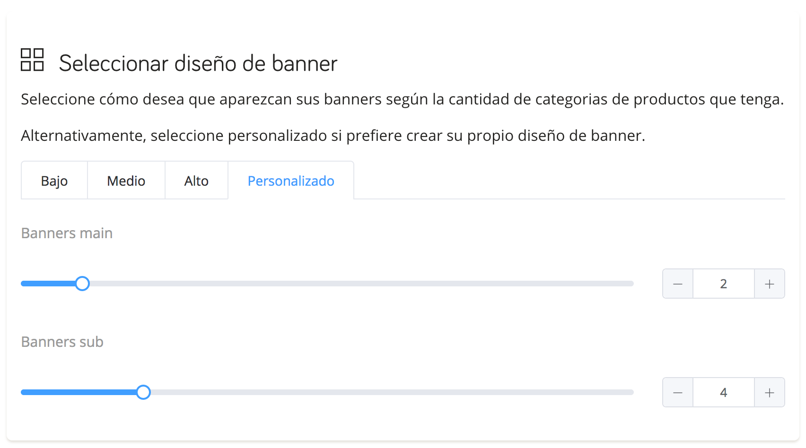

# Banners

Los banners son la parte más notoria de tu página de inicio. Por lo general, se muestran inmediatamente encima del pliegue (la zona the la página que requiere scrolling para ser vista) para atraer a los usuarios a un grupo de productos. Típicamente estos podrían ser:

- Categorías de productos (por ejemplo: jeans)
- Marcas de productos.

Debido a su capacidad para atraer la atención, es muy importante mostrar banners relevantes a tus visitantes en lugar de mostrarles a todos lo mismo.

## Inicio Rápido

1. Una vez que tengas instalada la aplicación Shopify DataCue, ve a la configuración de la aplicación y habilita las recomendaciones.

    

2. Ingresa al editor de temas para agregar una nueva sección.

3. Busca la categoría "datacue" y selecciona "DataCue Banners".

4. Elige o carga un banner estático y hazlo apuntar a algún lado. Este será mostrado a todos los visitantes.

   

5. Arrastra la sección recién agregada donde deseas que aparezcan los banners.

7. ¡Guarda tus cambios y listo!

8. Sigue las instrucciones en [la guía de banners del dashboard](/es/dashboard/banners.html) para seleccionar el diseño y cargar tus primeros banners. Alternativamente, lea nuestra guía sobre cómo crear tu propio [diseño personalizado](#diseno-personalizado).

## Cambiando tu banner estático

1. Vaya al editor de temas (`Inicio / Tienda en línea / Personalizar`).

   

2. Haga clic en la sección Banners de DataCue.

3. Use el botón 'seleccionar imagen' para cargar una nueva imagen, asegúrese de seguir las pautas de tamaño de una relación de aspecto de 5:3 (el tamaño recomendado es 1200 x 720 px). Luego ingrese un enlace al que debe ir el usuario cuando haga clic en el banner estático.

   

## Diseño personalizado

Está bien, así que has visto nuestros diseños de banner y tienes algo más sofisticado en mente. No te preocupes, podemos encargarnos totalmente de ello.

DataCue admite dos tamaños de banner, llamémoslos main y sub. Puedes elegir el tamaño que desees, pero deben ser consistentes. Por ejemplo, digamos que quieres un diseño como este:



Esto es lo que entendemos por coherente: todas las banners main son del mismo tamaño y tambien todas las sub son del mismo tamaño.

Vamos a implementar el diseño anterior!

::: tip CONSEJO
Si crees que lo anterior se ve terrible, lo sentimos. PERO... tu fuiste quien decidió no usar nuestros hermosos diseños estándar y construir el tuyo propio.
:::

Así que esto es lo que necesitas hacer:

1. Diseñas tu diseño utilizando una combinación de dos tamaños diferentes.

2. En el panel de control, vayas a la configuración del banner (`Banners / Configuración`)

3. Selecciones `Personalizar` y selecciones el número de banners main y sub que necesitas. Para el diseño anterior, requerimos 2 banners main y 4 sub.



4. Insertes un fragmento de código HTML como tal y ajústelo con CSS como desee.

``` html
<div data-dc-sub-insert-banner="1"></div>
<div data-dc-sub-insert-banner="2"></div>
<div data-dc-main-insert-banner="1"></div>
<div data-dc-sub-insert-banner="3"></div>
<div data-dc-sub-insert-banner="4"></div>
<div data-dc-main-insert-banner="2"></div>
<a href="/collections/mi-coleccion"></a>
```

Puedes usar cualquier nombre / atributo de clase como desee en la etiqueta `div`. El único requisito es que agregues el nombre de atributo correcto `data-dc-main-insert-banner` para main y `data-dc-sub-insert-banner` para sub. Los números solo nos dicen en qué orden colocar los banners. Algo como poner el primer banner main aquí, colocar el segundo banner main allí.

En caso de que tenga curiosidad por más detalles técnicos. Nuestras recomendaciones se envían como una matriz, vea el ejemplo a continuación. El número se refiere al índice del elemento en cada matriz, comenzando con 1 en lugar de 0.

``` json
{
    "main_banners":[
        {"link":"/collection/jeans","photo_url":"jeans.jpg"},
        {"link":"/collection/tshirts","photo_url":"tshirts.jpg"}
    ],
    "sub_banners":[
        {"link":"/collection/hats","photo_url":"hats.jpg"},
        {"link":"/collection/shoes","photo_url":"shoes.jpg"}
        {"link":"/collection/belts","photo_url":"belts.jpg"},
        {"link":"/collection/chuck-norris","photo_url":"chuck-norris.jpg"}
    ],
}
```

3. Eso es todo!

De esta manera, podemos entregar el contenido correcto a cada usuario y puedes crear cualquier tipo de diseño avanzado que desee.
