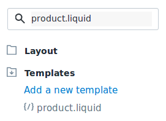

# Carousel de productos

DataCue ofrece tres tipos de recomendaciones de productos:

- Productos relacionados
- Productos similares
- Vistos recientemente

Puedes configurarlos en tu dashboard.

## Inicio Rápido

### Página de Inicio (Home)

1. Ve al editor de temas para agregar una nueva sección  
(`Home / Customize theme / Customize theme / Customize`).

2. Busca la categoría "datacue" y selecciona "Recomendaciones de producto de DataCue".

3. Arrastra la sección recién agregada a donde deseas que aparezcan los carruseles.

    

4. ¡Guarda tus cambios y listo!

### Página de producto

La mayoría de los temas no permiten agregar secciones personalizadas a las páginas de productos, pero hay algunas formas de hacerlo manualmente.

#### Method 1

Si estás familiarizado con la edición de temas, puedes encontrar la plantilla de la página del producto
(`templates / product.liquid`) en el editor de código:



Luego pega una etiqueta especial cerca del final de tu plantilla donde desees que DataCue inserte los carruseles:

```html
<div class="datacue-recommendations-anchor"></div>
```

#### Method 2

Alternativamente, puedes encontrar una clase CSS, dada por tu tema, para la sección de descripción del producto (como ejemplo, el tema Turbo usa `.main.content`) y escribir eso en la configuración de tu panel de control.
