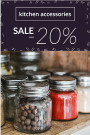
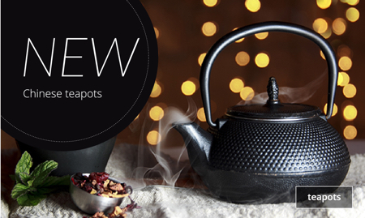
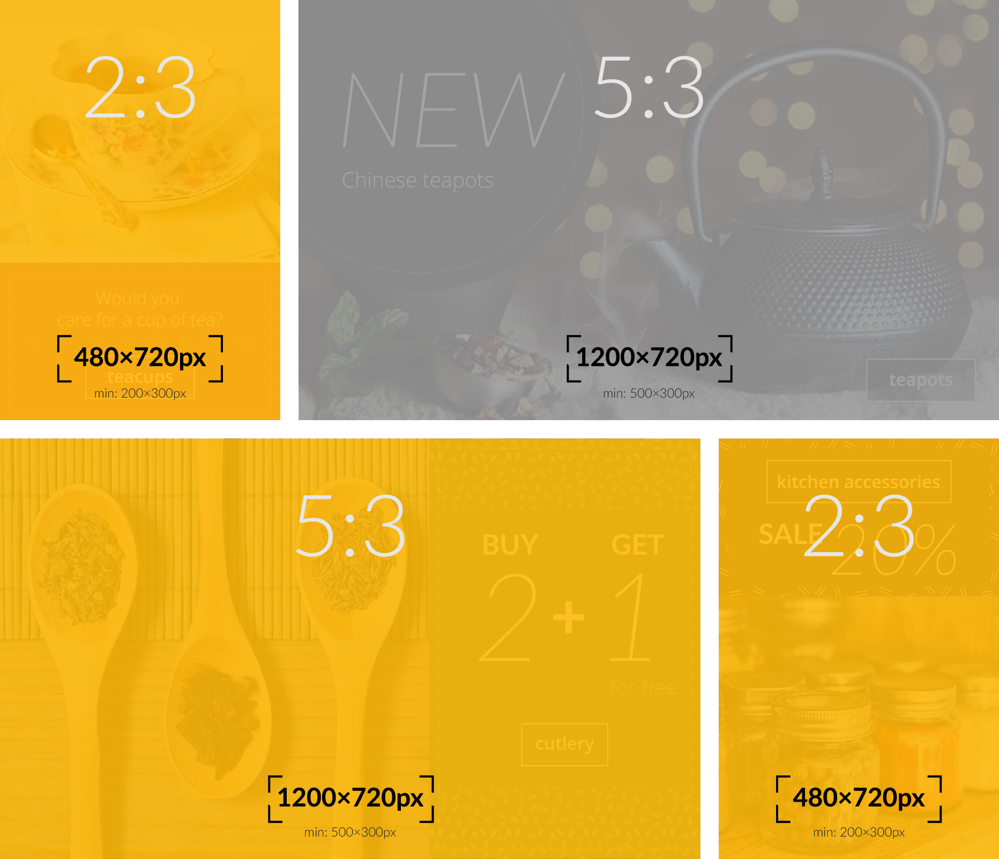
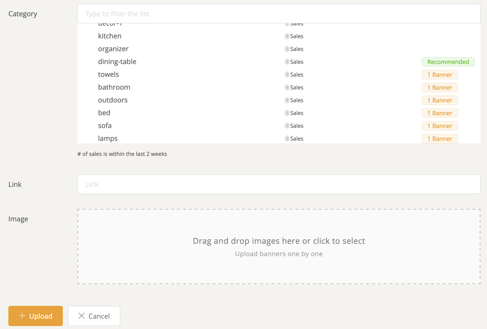

# Banners

Banners are the most prominent part of your home page. They are typically displayed immediately above the fold, the visible part of the page before you scroll. Banners tell users what to expect from your store and typically directs them to product categories.

Banners grab attention immediately. It's far more effective to show relevant banners per visitor instead of showing everybody the same thing.

## Quick Start

1. Before getting started you should review the different banner types supported by DataCue.  
   [Jump to Banner Types](#banner-types).

1. Then you can decide what layout works best for you.  
   [Jump to Banner Layout](#banner-layout)

1. Upload all the banners.  
   [Jump to Uploading a new banner](#uploading-a-new-banner)

## Banner Types

DataCue supports 3 types of banners explained below.

### Wide Banner (aspect ratio 5:3)

Wide banners are used to attract the most attention as they are larger and provide space for you to use elements like stylized text to attract attention. We will show the wide banners of collections that the user finds the most interesting.

Recommended size: **1200 x 720 px**

### Narrow Banner (aspect ratio 2:3)

Narrow banners act as a complement to the wide banner because they are smaller. After the wide banners are selected, we will look for all narrow banners that a user would find interesting.

We will show the narrow banners of collections that the user finds the most interesting that are not already shown as a wide banner. This means wide banners have priority.

Recommended size: **480 x 720 px**

::: tip
You can upload both a 'wide' and 'narrow' banner for a product category. We will make sure that both don't appear at the same time.
:::

### Static Banner (aspect ratio 5:3)

'Static' banners are not personalized and will remain the same for everyone. Use this when you want to promote a new product, or do any other type of broad messaging with your customers.

Recommended size: **1200 x 720 px**

## Banner Layout

We've made multiple layouts for different store sizes based on how many product categories you have. These are only suggestions so if you want to use a category that is meant for higher / lower product categories - feel free to try it.

If you know HTML + CSS, you can also do a completely custom layout and just insert them using the API.

### Low product variety (10 or fewer product categories)

| Desktop                                                             | Mobile                                                             |
| ------------------------------------------------------------------- | ------------------------------------------------------------------ |
|  |  |

### Medium product variety (10-20 product categories)

| Desktop                                                             | Mobile                                                             |
| ------------------------------------------------------------------- | ------------------------------------------------------------------ |
|  |  |

### High product variety (More than 20 product categories)

| Desktop                                                             | Mobile                                                             |
| ------------------------------------------------------------------- | ------------------------------------------------------------------ |
|  |  |

## Uploading a new banner

::: tip
If you delete or update a banner, this change is applied immediately.
:::

1. Click on 'Banners' in your dashboard sidebar

   

2. In the upload banner section, select the category you wish to associate with the banner.

   **Note**: We'll tell you which categories are the most popular sellers so you can prioritize.

3. We'll automatically generate the link for you based on the category you selected, you can modify it if you want to.

4. Drag and drop an image on to the striped box, or just click on it to browse for the banner image to upload it.

   

5. Click on `Upload`, thats it! You'll soon see your new banner appear in the existing banners section.git

   
