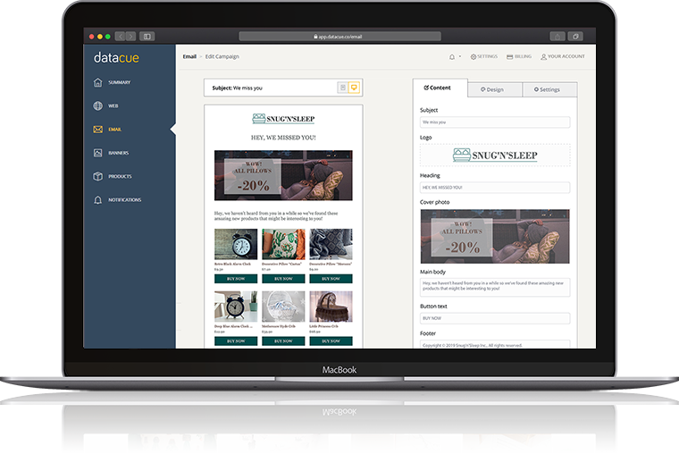
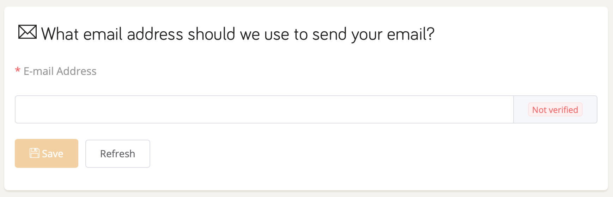

# Email

Email is one of those things that you know you need to be doing but it takes so much time to get right. Keeping up with our motto of keeping things simple, you can setup automated customer recovery emails very quickly with DataCue.

Just use our easy to use email designer, and setup the email template to reflect your brand, we'll do the rest.

## Quick Start

- Click on Settings > Email and type the email address you would like us to use to send emails on your behalf.

  

- If you use MailChimp, we can also connect to it and get all the list of customers who have unsubscribed from your emails. This ensures we don't send emails to anyone who's already unsubscribed. You will need an API key, follow MailChimp's documentation below if you're not sure what your API key is.

  [MailChimp Docs - How to create an API key](https://mailchimp.com/en/help/about-api-keys/)

- Finally, just click on 'Add new campaign' in the email section and get to work on your beautiful email.

- Once you're done, you can click on the `launch campaign` option to begin sending emails to your customers.

## Email analytics

The email page shows you valuable statistics about your email campaigns.

- Filter by date: Use the date picker on the top right to select the to and from dates to view email results in the specified range.
- The 4 summary cards show you overall email campaign performance:
  - Sent: Number of sent emails.
  - Opened: Number of opened emails.
  - Clicked: Number of emails with at least one click.
  - Conversions: Value of sales attributed to clicked emails.
- View the campaign table to see results broken out by each campaign type.

## Email designer

The designer is split into 3 sections

### Content

Here you decide what content should go in your email, like the subject, logo image and any text you want to add in the body.

### Design

Select all your styling options like colors, font size etc.

### Settings

Setup campaign parameters here like how many days after a purchase do you want us to email a customer. You also select to launch your campaign from here.
