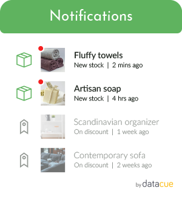
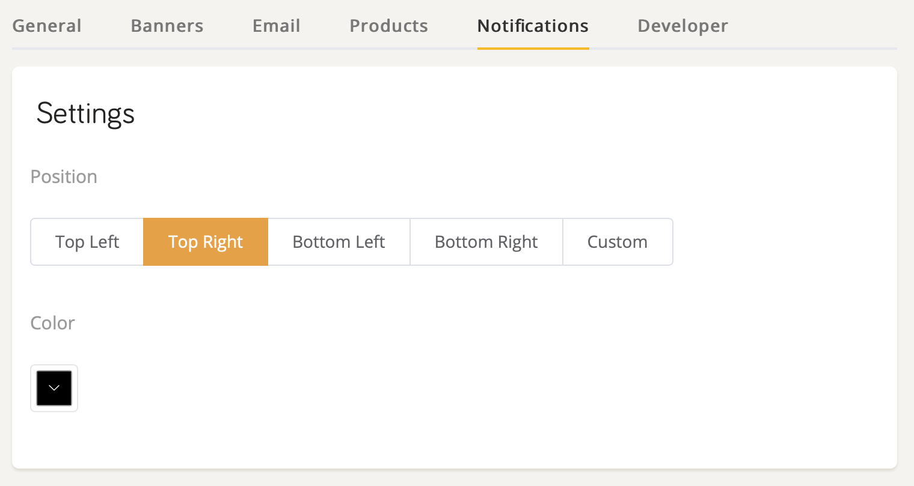

# Notifications

Pop-ups lead to a poor user experience because they are designed to interrupt and are often not relevant. Instead, it's better to simply let users know there is a notification so they can click on it if they are interested. Even better, those notifications should always be relevant so users are delighted instead of annoyed.

DataCue can show personalized notifications to a user if a product they looked at recently is:

- Low in stock
- Back in stock
- On discount

  

## Quick Start

1. Login to your dashboard and click on Notifications.
2. Customize the settings as you like and you're done

## Customization

You can customize two settings in your notifications panel:

1. **Notification bell position**: you can pick between top left, top right, bottom left or bottom right. (See the [next topic](#advanced-positioning) for a more advanced method)

2. **Pane color**: pick a panel color to match your website's colors. If you're a developer, feel free to override the CSS we use to make more advanced design changes.

## Advanced Positioning

The default and easiest way to get started is to have a floating notification bell.

If you want to integrate the notifications icon into your navigation bar, follow our [advanced positioning guide](/install/advanced.html#notifications-icon-positioning).
