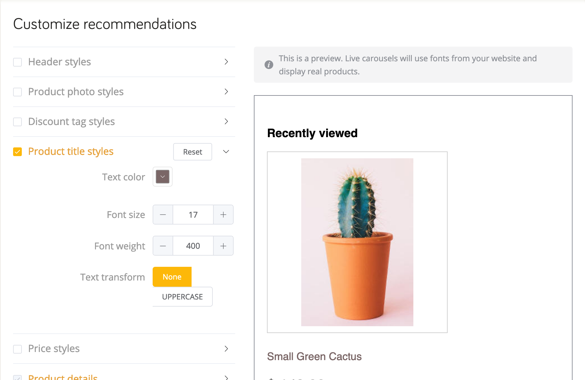

# Magento <Badge text="beta" type="success"/>

Welcome to our guide on how to install and use DataCue on your Magento store.

**Stuck?**

Just reach out to us using the support email in your Magento admin panel and we'll help you get started.

::: warning Warning
This module is ONLY for Magento 2.3 and higher. Magento 2 users should upgrade their systems. If you're on Magento 1, please refer to our [API documentation](https://developer.datacue.co) to integrate.
:::

## Step 1: Installation

### Before You Start

Here are some things to know before you begin the integration process.

- The DataCue module for Magento requires at least **Magento 2.3 or higher**.

- Please test this module in a staging environment **first** before installing it on production servers. Modules may sometimes affect each other, and the LAST place you want to discover this is on your live site. Ideally, your staging environment is a clone of your actual production site.

- DataCue for Magento syncs your products, your customer’s first name, last name, email address, and orders.

- It also installs our Javascript library on your home page, product pages, category pages and search results page. The Javascript library personalizes your website content to each visitor's activity.

Depending on your countries privacy laws, you may need to explicitly get permission from the user to use content personalization. Please consult with legal counsel if you're in any doubt.

### Installing the module

1. Go to the root directory of your Magento installation.

2. Run the following commands

   ```bash
   # install the module
   composer require datacue/magento_module
   # enable the module
   bin/magento module:enable --clear-static-content DataCue_MagentoModule
    # Enable maintenance mode
   bin/magento maintenance:enable
   bin/magento setup:upgrade
   bin/magento cache:clean
   bin/magento setup:di:compile
   # deploy static content
   bin/magento setup:static-content:deploy
   ```

3. Optional but recommended steps

   ```bash
   # update your index tables
   bin/magento indexer:reindex

   # avoid cache conflicts by doing a flush
   bin/magento cache:flush
   ```

4. Check that installation is OK and disable maintenance mode

   ```bash
   # Make sure the module is enabled.
   bin/magento module:status DataCue_MagentoModule

   # Disable maintenance mode
   bin/magento maintenance:disable
   ```

5. Login to your Magento store's admin panel. You will find a link called DataCue Settings under the Marketing section. Click on it.

   

6. Enter your API key and API secret (you can find it on your dashboard) and press Save.

   Depending on the size of your store the sync process can take a few mins to a few hours.

   :::tip Tip
   Don't have a DataCue account? [sign up here](https://app.datacue.co/en/sign-up)
   :::

#### Troubleshooting

The most common issue is due to incorrect file permissions. Make sure all the important folders like `generated`, `pub` and `vendor` have the same permissions as the magento user.

## Step 2: Add recommendations

### Banners

1. Upload a fixed banner that all your visitors see. Make sure it has a publicly accessible URL, you'll need it later.

   If you're unsure, pick a banner to highlight your most popular collection or a promotion. Ensure the image has an aspect ratio of 5:3 (recommended size is 1200 x 720 px). Learn more about static banners [here](/banners).

2. Click `Content` on your left side bar.

3. Pick a `Block` thats in your home page, or directly go to your home page under `Pages`. Click on `Edit`.

4. Click on the `Insert Widget` button.

5. In widget type selector, choose `DataCue Banner`, fill in `Banner Image` with the URL from step 1 and enter the link for that banner under `Banner Link`.

6. Click `Insert Widget` and then save the current page or block.

7. You should see the banner image that you uploaded on your home page.

The default layout DataCue uses for your banners shows 2 dynamic banners and 1 static banner on one row. You can customize this by going to `Settings > Banners` in your DataCue dashboard. Read more about it [here](/banners/layout.html).

Want to build your own custom layout? [read this](#custom-layout).

#### Changing your static banner

1. Upload a new image to your server and copy the URL. Ensure the image has an aspect ratio of 5:3 (recommended size is 1200 x 720 px). Update the link for the static banner if necessary.

2. Edit the `block` or `page` where you inserted the banner widget. Edit the image URL to the new image you uploaded and and change the `link` to the banner as appropriate.

### Setup Product Recommendations

#### Option 1 - Insert via CSS (Recommended)

If you are familiar with CSS, you can insert product recommendations easily by just specifying a [CSS selector](https://www.w3schools.com/css/css_selectors.asp) for an element. The product recommendations will be inserted _directly below it_.

Go to `Settings > Developer` and find the **Product Placement** section.


Click on the `Save` button when you're done, and we'll check your website for you. If the CSS looks ok, you'll see a green tick mark. If not, you'll see a red warning symbol.

:::tip Tip
Option 2 (below) has a higher priority. If you insert recommendations via HTML and CSS (why would you do this?), your CSS settings will be ignored.
:::

#### Option 2 - Insert via HTML

1. Click `Content` on your left side bar.

2. Pick a `Block` or `Page` corresponding to the page you want to insert the recommendations.

3. Click on the `Insert Widget` button and choose `Datacue Products`. Pick `All` and save your changes.

4. As soon as product recommendations are ready, you will start seeing them on your site.

## Step 3: Match widgets to your theme

DataCue's product recommendations have a default design which will need some adjustments to match the look/feel of your store. This is really important so nothing looks out of place.

### Test mode

The first thing you should do is set DataCue into test mode from your dashboard. In test mode, you can pick a list of user accounts as test users. To see the recommendations, you have to sign in as a test user to your store. All other visitors don't see any changes. This is very helpful to play with the design till you're happy with the look/feel. To learn how to set DataCue to test mode, click [here](/install/testmode.html)

### Customize recommendations look/feel

#### 1. Friendly design editor

You can customize most of the look/feel of the product sections yourself with our super easy design editor. Just play with the settings till the preview looks good to you and save your changes.



#### 2. Advanced designs with CSS

If you want to make advanced changes, feel free to use CSS directly. We've made all the elements within the product recommendation widget accessible with unique class names.

## Disable or Uninstall the module

When you deactivate and delete DataCue for Magento, we remove all changes made to your store including the Javascript. We also immediately stop syncing any changes to your store data with DataCue. To deactivate DataCue for Magento, follow these steps.

1. Go to the root directory of Magento.

   ```bash
   bin/magento module:disable --clear-static-content DataCue_MagentoModule

   bin/magento module:uninstall --clear-static-content DataCue_MagentoModule

   bin/magento setup:di:compile
   ```

2. You may need to change file permissions or ownership of the generated files after the uninstallation.

3. Confirm the module is now deleted.

   ```bash
   bin/magento module:status DataCue_MagentoModule
   ```
