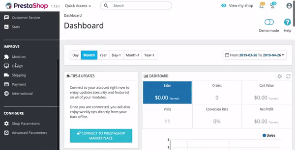

# PrestaShop <Badge text="private beta" type="warn"/>

Welcome to our guide on how to install and use DataCue on your PrestaShop store.

**Stuck?**

Just reach out to us using the support email in your PrestaShop admin panel and we'll help you get started.

## Installation

### Before You Start

Here are some things to know before you begin the integration process.

- The DataCue module for PrestaShop requires at least PrestaShop 1.7.4 or higher.

- Please test this plugin in a staging environment **first** before installing it on production servers. Modules may sometimes affect each other, and the last place you want to discover this is on your live site. Ideally, your staging environment is a clone of your actual production site.

- DataCue for PrestaShop syncs your products, your customer’s first name, last name, email address, and orders.

- DataCue for PrestaShop also installs our Javascript library on your home page, product pages, category pages and search results page. The Javascript library personalizes your website content to each visitor's activity.

Depending on your countries privacy laws, you may need to explicitly get permission from the user to use content personalization. Please consult with legal counsel if you're in any doubt.


### Installing the module

1. PrestaShop is in private beta [contact us](https://datacue.co/contact) to get the installer.

2. Install the module from your PrestaShop Admin panel by clicking on `Modules Manager > Upload a Module`. Select the ZIP file of the DataCue installer.

    

3. Once installed, scroll down to find the DataCue module under "Others".

4. Enter your DataCue API Key and Secret and press "Save" to connect your store to DataCue. You can find the API Key and Secret on the first screen you see when you login to your [DataCue dashboard](https://app.datacue.co). 

    ::: tip
    If you dismissed the API key + secret screen for any reason, don't worry. You can access it again by clicking on your store name on the top right click on "Developer" from the menu.
    :::
    
5. Depending on the size of your store the sync process can take a few mins to a few hours. You can monitor progress by switching to the "sync" tab.

### Disable or Uninstall the module

When you disable or Uninstall DataCue for PrestaShop, we remove all changes made to your store including the Javascript. We also immediately stop syncing any changes to your store data with DataCue.

To disable DataCue for PrestaShop, follow these steps.

- Log in to your PrestaShop admin panel.

- On the left navigation panel, click `Module Manager`, and scroll down to the DataCue module.

- Select the drop down menu on the right of the module and select Disable or Uninstall.

## Add recommendations

### Banners

1. Select a banner to use as as your "Static Banner", a banner that all your visitors see. Upload a banner image to be shown to all your visitors. If you're unsure, pick a banner to highlight your most popular collection or a promotion. Ensure the image has an aspect ratio of 5:3 (recommended size is 1200 x 720 px). Learn more about static banners [here](/banners).

2. Insert the following html in your `index.tpl` file:

    ```html
    <div
    data-dc-banners
    data-dc-static-img="path/to/your/banner.jpg"
    data-dc-static-link="link/to/chosen/category"
    ></div>
    ```

    Remember to change the urls for `data-dc-static-img`  and `data-dc-static-link` correctly.

    `static-img` is the URL of the image you uploaded in step 1.
    `static-link` is the link to send the user when they click on the banner. Set an appropriate URL for your store, typically a category page.

3. The default layout DataCue uses for your banners shows 2 dynamic banners and 1 static banner on one row. You can customize this by going to `Banners > Settings` in your DataCue dashboard. Read more about it [here](/banners/layout.html). Alternatively, find out how to build your own [custom layout](#custom-layout).

#### Changing your static banner later

1. Upload a new image to your server and copy the URL. Ensure the image has an aspect ratio of 5:3 (recommended size is 1200 x 720 px). Update the link for the static banner if necessary.

2. Edit your `index.tpl` file and find the `data-dc-banners` html snippet and and change the `static-img` to the URL you copied from step 1. Set the `static-link` attribute as appropriate.

### Setup Product Recommendations

**Home page**

Insert the following html in your `index.tpl` file:

```html
<div data-dc-products></div>
```

**Product page**

Insert the following html in your `product.tpl` file:

```html
<div data-dc-products></div>
```

### Match widgets to your theme

DataCue's product carousels have a default design which will need some adjustments to match the look/feel of your store. This is really important so nothing looks out of place.

**Test mode**

The first thing you should do is set DataCue into test mode. In test mode, you can pick a list of user accounts as test users. To see the recommendations, you have to sign in as a test user to your store. All other visitors don't see any changes. This is very helpful to play with the design till you're happy with the look/feel.

You will need to know a little CSS to match the design, so there are two options

**1. Let us help you (recommended)**

When you sign up, we'll get in touch with you and offer to help you with setting up your store.

**2. Do it yourself**

Feel free to reach out if you need any help.