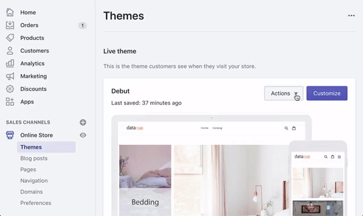

# Shopify

Welcome to our guide on how to install and use DataCue on your Shopify store.

**Stuck?**

Just reach out to us using the support email in your Shopify app and we'll help you get started.

## Install the app

First things first, if you haven't already done so, install the Shopify app.

Click [here](https://apps.shopify.com/datacue) to install the app from the Shopify app store.

## Add Recommendations

### Quick start: Add Banners + Products to your home page


### Setup banner (growth plan and higher) recommendations

1. Click on "Online Store" on your sidebar
    

2. Click on "Customize" to go to the theme editor

    

3. Click on "Add section", add the "DataCue Banners" section

    

4. Click on "Select Image" to pick your static banner. Static banners are defined by you and appear for all your visitors. Use them to highlight your most popular collection or a promotion. Ensure the image has an aspect ratio of 5:3 (recommended size is 1200 x 720 px). Learn more about static banners [here](/banners).

   

5. Click on the back button above, and then drag the newly added banners section to the top. We recommend adding this at the top just after your navigation bar. Go ahead and hide / remove any existing banner elements you used to have like slideshows.

    

6. Save your changes

7. The default layout DataCue uses for your banners shows 2 dynamic banners and 1 static banner on one row. You can customize this by going to `Banners > Settings` in your DataCue dashboard. Read more about it [here](/banners/layout.html). Alternatively, find out how to build your own [custom layout](#custom-layout).

#### Changing your static banner later

1. Go to DataCue Banner settings from your Shopify admin panel (`Online Store > Customize theme > DataCue Banners`).

2. Click on the 'select image' button to upload a new image. Ensure the image has an aspect ratio of 5:3 (recommended size is 1200 x 720 px). Update the link for the static banner if necessary.

### Setup Product Recommendations (All plans)

**Home page**

1. Go to the theme editor (`Home / Customize theme / Customize theme / Customize`).

   

2. Click "Add section", then find the "Datacue" category and pick "DataCue Products".

   

3. Drag the newly added section to where you want the carousels to appear.
    

4. Save your changes and you're done!

**Product page**

Most themes don't allow adding custom sections to product pages, but you can do it manually.

If you're familiar with theme editing, you can find the product page template
(`templates/product.liquid`) in the code editor:


Then paste a special tag near the end of your template, where you want DataCue to insert the carousels:

```html
<div data-dc-products></div>
```



**Advanced positioning**

You can also place each product recommendation in different parts of your product page. Just modify the code slightly to tell us what type of recommendation you want and insert the code where you want it to appear.

Related products

```html
`<div data-dc-products="related"></div>`
```

Similar products

```html
`<div data-dc-products="similar"></div>`
```

Recently viewed products

```html
`<div data-dc-products="recent"></div>`
```

### Match widgets to your theme

DataCue's product carousels have a default design which will need some adjustments to match the look/feel of your store. This is really important so nothing looks out of place.

**Test mode**

The first thing you should do is set DataCue into test mode. In test mode, you can pick a list of user accounts as test users. To see the recommendations, you have to sign in as a test user to your store. All other visitors don't see any changes. This is very helpful to play with the design till you're happy with the look/feel.

You will need to know a little CSS to match the design, so there are two options

**1. Let us help you (recommended)**

When you install the app, we'll get in touch with you and offer to help you with setting up your store.

**2. Do it yourself**

Wow, go right ahead. We've made a file called datacue_custom.css in your theme code. You can add all the styles you need in there so it's nicely separated from the other style code in your store. Feel free to reach out if you need any help.
