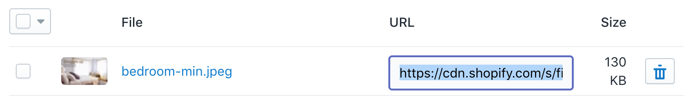

# Shopify

Welcome to our guide on how to install and use DataCue on your Shopify store.

**Stuck?**

Just reach out to us using the support email in your Shopify app and we'll help you get started.

## Step 1: Install the app

First things first, if you haven't already done so, install the Shopify app.

Click [here](https://apps.shopify.com/datacue) to install the app from the Shopify app store.

## Step 2: Add Recommendations

### Quick start

Add Banners + Products to your home page


### Setup banner recommendations

#### Themes with section support

1. Head to your theme editor, Click on `Online Store` on your side bar and click on the `Customize` button.

2. Click on `Add section`, then add the section `DataCue Banners`

    

    ::: tip Tip
    Don't see any sections? It's likely your theme doesn't support them. Scroll down to view instructions for themes that don't support sections.
    :::

3. Upload your static banner by clicking on `Select Image`.

    Static banners are defined by you and appear for all your visitors. Use them to highlight your most popular collection or a promotion. Ensure the image has an aspect ratio of 5:3 (recommended size is 1200 x 720 px). Learn more about static banners [here](/guide/banners).

   

4. Click on the back button, then drag the banners section to the top. Hide / remove any existing banner type elements you used to have like slideshows.

    

5. Save your changes

Refer our Banners usage guide [here](/guide/banners.html#banner-layout) to find out how to customize the layout, and add new banners.

#### Themes without sections support

1. Upload your static banner by going to `Settings > Files`. Click on `Upload files` and select the image you want.

    Static banners are defined by you and appear for all your visitors. Use them to highlight your most popular collection or a promotion. Ensure the image has an aspect ratio of 5:3 (recommended size is 1200 x 720 px). Learn more about static banners [here](/guide/banners).

2. Copy the URL next to the image you uploaded, you'll need it later.

    

3. Click on `Online store` on your sidebar then click on `Actions > Edit Code`

4. Type `index.liquid`, click on it in the search results. Then paste the code below at the position you want (higher the better). Remember to paste the static banner URL you got from step 1 in `data-dc-static-img` and the link for the static banner in `data-dc-static-link`.

    ``` html
    <div
    data-dc-banners
    data-dc-static-img="<url you copied from step 1>"
    data-dc-static-link="link/to/chosen/category"
    ></div>
    ```

    

5. Click on `Save` and you're done! Check your home page to ensure everything looks good, you can move the position of the code to adjust the location of the banners.

#### Changing your static banner later

1. Go to DataCue Banner settings from your Shopify admin panel (`Online Store > Customize theme > DataCue Banners`).

2. Click on the 'select image' button to upload a new image. Ensure the image has an aspect ratio of 5:3 (recommended size is 1200 x 720 px). Update the link for the static banner if necessary.

### Setup Product Recommendations

#### Home page

1. Head to your theme editor, Click on `Online Store` on your side bar and click on the `Customize` button.

   

2. Click "Add section", then find the "Datacue" category and pick "DataCue Products".

   

3. Drag the newly added section to where you want the carousels to appear.
    

4. Save your changes and you're done!

#### Product page and other pages

Most themes don't allow adding custom sections to other pages, but you can do it easily by pasting a code snippet.

Product recommendations can be added to the following pages:

- Product page
- Category page
- Search page
- Cart page
- 404 page

To get started:

1. Head to your theme code editor, Click on `Online Store` on your side bar, click on the `Actions` button and select `Edit code`.

2. Type the name of the template you want to edit, below is an example of editing the product template.


3. Insert this snippet where you want to insert the product recommendations. You can move it up / down as you like till you're happy with the position.

```html
<div data-dc-products></div>
```


#### Advanced positioning

You can also place each product recommendation in different parts of your product page. Just modify the code slightly to tell us what type of recommendation you want and insert the code where you want it to appear.

Related products

```html
`<div data-dc-products="related"></div>`
```

Similar products

```html
`<div data-dc-products="similar"></div>`
```

Recently viewed products

```html
`<div data-dc-products="recent"></div>`
```

## Step 3: Match widgets to your theme

DataCue's product recommendations have a default design which will need some adjustments to match the look/feel of your store. This is really important so nothing looks out of place.

### Test mode

The first thing you should do is set DataCue into test mode from your dashboard. In test mode, you can pick a list of user accounts as test users. To see the recommendations, you have to sign in as a test user to your store. All other visitors don't see any changes. This is very helpful to play with the design till you're happy with the look/feel. To learn how to set DataCue to test mode, click [here](/install/testmode.html)

### Customize recommendations look/feel

#### 1. Friendly design editor

You can customize most of the look/feel of the product sections yourself with our super easy design editor. Just play with the settings till the preview looks good to you and save your changes.


#### 2. Advanced designs with CSS

If you want to make advanced changes, feel free to use CSS directly. We've made all the elements within the product recommendation widget accessible with unique class names.

## Uninstalling the app

We're sorry to see you go! Uninstalling the app can be done easily by clicking on the trash icon next to the DataCue app in your Shopify admin section.

When you uninstall the app:

- Billing is immediately stopped.
- All your store data like customers, orders and products are immediately deleted from DataCue.
- Your dashboard account and banners will continue to exist. You can delete all your banners from the dashboard should you wish.

When an app is uninstalled, the app cannot make any modifications to your store. This means that some DataCue code will continue to remain in your theme. It is harmless but it's recommended to completely remove it.

To remove all DataCue code:

1. Go to the Shopify code editor (`Online Store > Actions > Edit Code`).

2. Find `theme.liquid` and open it

3. Make a local backup just in case!

4. Locate the code block labeled DataCue and delete it (make sure to ONLY remove DataCue code and nothing else).

5. Save your changes and in another tab verify that your site is working correctly. If all OK, you can close the code editor.

If for any reason, your site does not behave correctly after this change, restore the code using your local backup. Then repeat the above steps taking care NOT to delete anything except the block labelled DataCue.
