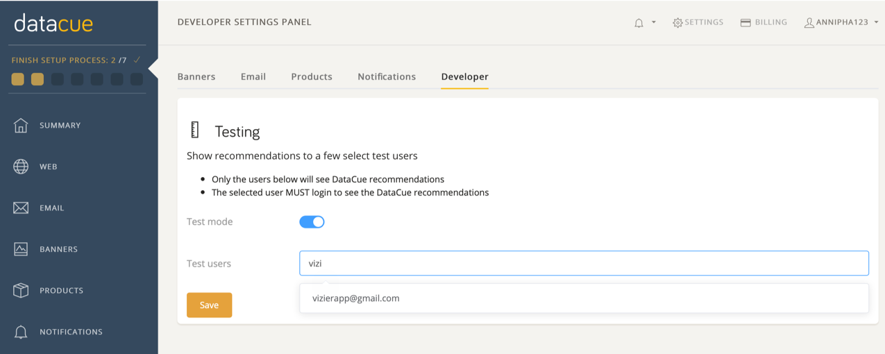

# Test Mode

## Set DataCue to Test Mode 

The first thing you should do after downloading DataCue is to set it into Test Mode until you're happy with the design.

1. Click [here](https://app.datacue.co) to log in to your dashboard.

2. In the dashboard, go to settings on the top right corner

3. Click on the Developer tab

4. Turn the test mode on

    

## Pick Test Users 

Once the recommendations are ready and after you have added DataCue product recommendation carousel, you can start seeing recommendations. Exciting! 

To do this, you just need to pick a list of user emails as test users. Simply start typing the email of the test user and we will autocomplete it for you. 

To see the recommendations, you have to sign in as a test user to your store. All other visitors will not see any changes.

