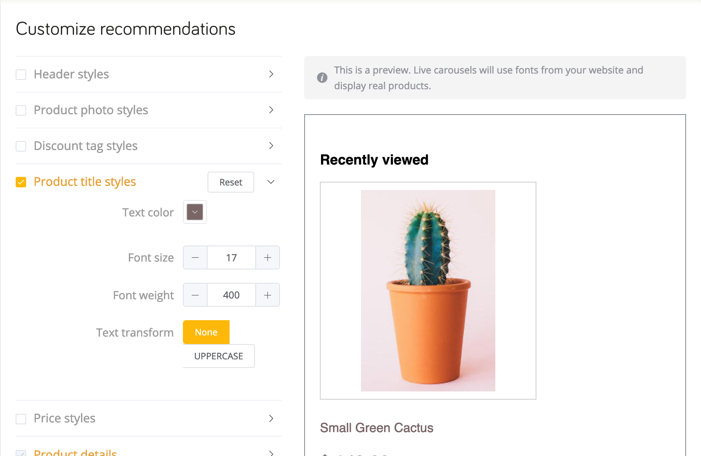

# WooCommerce <Badge text="beta" type="success"/>

Welcome to our guide on how to install and use DataCue on your WooCommerce store.

**Stuck?**

Just reach out to us using the support email in your WooCommerce admin panel and we'll help you get started.

## Installation

### Before You Start

Here are some things to know before you install the plugin.

- You must have the WooCommerce plugin already installed and activated in WordPress.

- Your host environment must meet WooCommerce's minimum requirements, including PHP 7.0 or greater.

- Please test this plugin in a staging environment **first** before installing it on production servers. Plugins may sometimes affect each other, and the last place you want to discover this is on your live site. Ideally, your staging environment is a clone of your actual production site.

- Caching plugins may interfere with the syncing process, we recommend you turn any **OFF** before the installation until the sync has completed successfully.

- DataCue for WooCommerce syncs your product catalog; your customer’s first name, last name and email address; and orders.

- DataCue for WooCommerce also installs our Javascript library on your home page, product pages, category pages and search results page. The Javascript library personalizes your website content to each visitor's activity.

Depending on your countries privacy laws, you may need to explicitly get permission from the user to use content personalization. Please consult with legal counsel if you're in any doubt.


### Installing the plugin

1. Download the plugin

    <Button link="https://cdn.datacue.co/assets/integrations/datacue-woocommerce-latest.zip" text="Download"/>

    ::: tip
    Safari on Mac OS X may sometimes auto expand your ZIP file into a folder. You may wish to use another browser if this happens. Alternatively, you can disable the `Open "safe" files after downloading` option in Safari preferences.
    :::

2. Install the plugin from your WordPress / WooCommerce Admin panel by clicking on `Plugins > Add New > Upload plugin > Choose File`. Select the ZIP file you just downloaded and click Install Now.

    

3. Once installed, select "Activate Plugin"

4. Enter your DataCue API Key and Secret and press "Save" to connect your store to DataCue. You can find the API Key and Secret on the first screen you see when you login to your [DataCue dashboard](https://app.datacue.co). 

    

    ::: tip
    If you dismissed the API key + secret screen for any reason, don't worry. You can access it again by clicking on your store name on the top right click on "Developer" from the menu.
    :::

    
5. Depending on the size of your store the sync process can take a few mins to a few hours. You can monitor progress by switching to the "sync" tab.

### Deactivate or Delete the Plugin

When you deactivate DataCue for WooCommerce, we remove all changes made to your store including the Javascript. We also immediately stop syncing any changes to your store data with DataCue.

To deactivate DataCue for WooCommerce, follow these steps.

- Log in to your WordPress admin panel.

- On the left navigation panel, click Plugins, and choose Installed Plugins.

- Click the box next to the DataCue for WooCommerce plugin, and click Deactivate.

- After you deactivate the plugin, you will have the option to Delete the plugin. 

::: tip
If you see an error that the plugin is still active, you are most likely running a caching plugin. Disable the cache / refresh the cache and try deleting it again.
:::

## Add recommendations

DataCue uses "shortcodes" to help you easily add dynamic banners and product recommendations to your website without requiring any code knowledge. You can read more about them [here (wordpress.com).](https://en.support.wordpress.com/shortcodes/)

::: tip
Did you know that WooCommerce is a plugin for WordPress? Most features offered by WordPress can be used on WooCommerce like shortcodes.
:::


### Banners

1. Select a banner to use as as your "Static Banner", a banner that all your visitors see. From your Dashboard go to `Media > Add New`, and select a banner image to be shown to all your visitors. If you're unsure, pick a banner to highlight your most popular collection or a promotion. Ensure the image has an aspect ratio of 5:3 (recommended size is 1200 x 720 px). Learn more about static banners [here](/banners).

2. Click on the newly uploaded image in your "Media Library" and copy the URL. You'll need this for the next step.

3. From your Dashboard click on "Pages" and open your Home page. Insert the code snippet below right after your navigation bar. 

    Remember to change the urls for `static-img`  and `static-link` correctly.

    `static-img` is the URL you got from the previous.
    `static-link` is the link to send the user when they click on the banner. Set an appropriate URL for your store, typically a category page.

    ```
    [datacue-banners static-img="/path/to/img.jpg" static-link="/link/to/category"]
    ```

4. The default layout DataCue uses for your banners shows 2 dynamic banners and 1 static banner on one row. You can customize this by going to `Settings > Banners` in your DataCue dashboard. Read more about it [here](/banners/layout.html). Alternatively, find out how to build your own [custom layout](#custom-layout).

#### Changing your static banner later

1. Upload a new image to your WordPress media library and copy the URL. Ensure the image has an aspect ratio of 5:3 (recommended size is 1200 x 720 px). Update the link for the static banner if necessary.

2. Go to "Pages" and edit your Home page.

3. Find the datacue banners short code and change the `static-img` to the URL you copied from step 1. Set the `static-link` attribute as appropriate.

### Setup Product Recommendations

**Home page**

1. Go to the page editor and select your Home page.

2. Edit the code and add the product recommendations shortcode to where you want it.

    ```
    [datacue-products]
    ```

3. Save your changes and you're done!

**Product page**

Customizing your product page requires editing of your theme PHP files. 
If you're familiar with theme editing, you can find the product page template here: `plugins\woocommerce\templates\single-product\product-image.php`

add the PHP code where you want to see the product recommendations.

```php
<?php echo do_shortcode( '[datacue-products]' ); ?>
```

### Match widgets to your theme

DataCue's product recommendations have a default design which will need some adjustments to match the look/feel of your store. This is really important so nothing looks out of place.

### Customize recommendations look/feel

#### 1. Friendly design editor

You can customize most of the look/feel of the product sections yourself with our super easy design editor. Just play with the settings till the preview looks good to you and save your changes.



#### 2. Advanced designs with CSS

If you want to make advanced changes, feel free to use CSS directly. We've made all the elements within the product recommendation widget accessible with unique class names.
