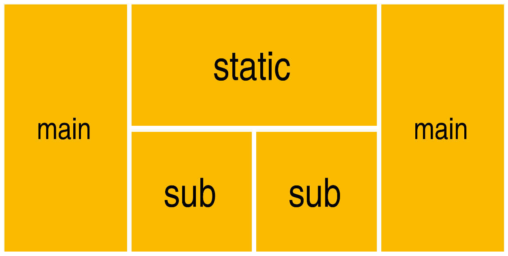

# Integrando sua loja com o DataCue

A integração do DataCue com a sua loja personalizada é fácil porque ela funciona como uma API.

Nossa documentação da API tem exemplos de código em linguagens de programação populares para mostrar como integrar o DataCue ao seu site. Para começar, mostre seu desenvolvedor a nossa [Documentação do desenvolvedor](https://developer.datacue.co/).

# Tópicos avançados

## Layout dos banners

### Layout personalizado

OK, então você olhou nossos layouts de banner padrões, e você tem algo mais sofisticado em mente. Não se preocupe, podemos cuidar totalmente disso.

O DataCue suporta dois tamanhos de banners, permite chamá-los Main e Sub. Você pode escolher qualquer tamanho que quiser, mas eles precisam ser consistentes. Por exemplo, digamos que você quer um layout como este:



Isto é o que entendemos por consistente: todos os Main são do mesmo tamanho, e todos os Sub são do mesmo tamanho.

Vamos implementar o design acima!

::: dica
Se você acha que o acima parece terrível, sentimos muito. MAS ... você é quem decidiu não usar nossos belos layouts padrão e construir o seu próprio.
:::

Para começar, isso é o que você deve fazer:

1. Crie seu layout usando uma combinação de dois tamanhos diferentes.

2. No Dashboard, acesse as configurações de banner (`Banners / Settings`)

3. Selecione `Custom` e selecione o número de banners Main e Sub que você precisa. Para o design acima, exigimos 2 banners Main e 2 banners Sub.

   ! [Banner settings](./images/banner-settings.png)

4. Insira um trecho de código HTML como esse e estilize-o com o CSS como desejar:

   ```html
   <div class="custom-banners">
     <div class="custom-static">
       <a href="https://example.com/any-link-you-want">
         
       </a>
     </div>
     <div class="custom-big" data-dc-main-insert-banner="1"></div>
     <div class="custom-big" data-dc-main-insert-banner="2"></div>
     <div class="custom-small" data-dc-sub-insert-banner="1"></div>
     <div class="custom-small" data-dc-sub-insert-banner="2"></div>
   </div>
   ```
  
   ```css
   .custom-banners {
     display: grid;
     grid-gap: 1em;
     grid-template-rows: 1fr auto;
     grid-template-columns:
       fit-content(calc(25% - 0.5em)) 1fr 1fr fit-content(calc(25% - 0.5em));
     grid-auto-flow: row dense;
   }

   .custom-banners a img { vertical-align: bottom; }

   .custom-static { grid-row: 1; grid-column: 2 / span 2; }

   .custom-big { grid-row: span 2; }
   ```

   O código acima é apenas um exemplo básico, mas a ideia é semelhante para qualquer layout. Você pode usar qualquer nome de classe que você goste nas tags `div`, elas nem precisam ser` div`s, você pode ter uma estrutura existente que você gostaria de adaptar. O único requisito é que você adicione o nome correto do atributo `data-dc-main-insert-banner` para os banners Main e` data-dc-sub-insert-banner` para os Sub. Os números nos dizem em qual ordem inserir os banners. Seria algo como colocar o 1º banner Main aqui, colocar o segundo banner Main alí.

   Caso você esteja curioso para obter mais detalhes técnicos. Nossas recomendações são enviadas como arrays, veja o exemplo abaixo. O número refere-se ao índice do elemento em cada array, começando com 1 em vez de 0.

   ``` json
   {
     "main_banners": [
       { "link": "/collection/jeans", "photo_url": "jeans.jpg" },
       { "link": "/collection/tshirts", "photo_url": "tshirts.jpg" }
     ],
     "sub_banners": [
       { "link": "/collection/hats", "photo_url": "hats.jpg" },
       { "link": "/collection/shoes", "photo_url": "shoes.jpg" },
       { "link": "/collection/belts", "photo_url": "belts.jpg" },
       { "link": "/collection/chuck-norris","photo_url": "chuck-norris.jpg" }
     ]
   }
   ```

5. É só isso!

Dessa forma, podemos fornecer o conteúdo certo para cada usuário e você pode criar qualquer tipo de layout avançado que desejar.

## Posicionamento do ícone de notificações