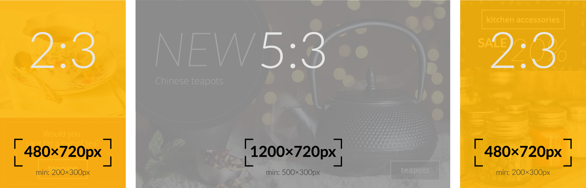
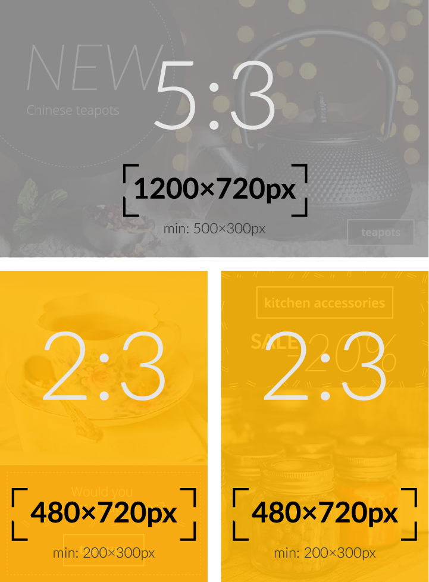
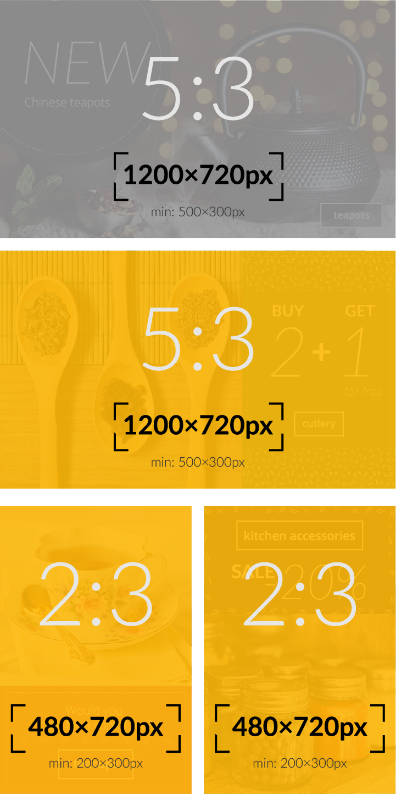
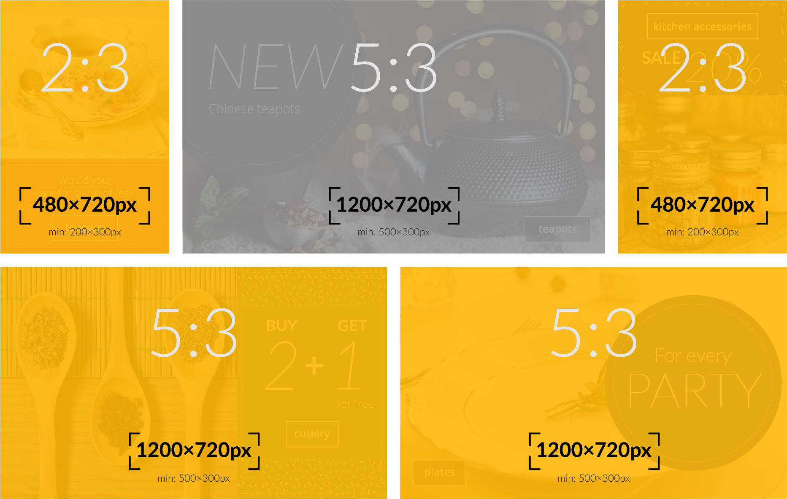
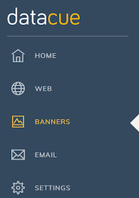

# Banners

Os banners são a parte mais importante da sua página inicial. Eles são normalmente exibidos imediatamente acima da dobra (a parte da página que normalmente requer que a rolagem seja vista) para atrair usuários para um grupo de produtos. Normalmente, estes poderiam ser:

- Categorias de produtos (por exemplo, jeans);
- Marcas de produtos.

Devido à sua capacidade de atrair a atenção, é muito importante mostrar banners relevantes para seus visitantes, em vez de mostrar a mesma coisa para todo mundo .

## Guia rápido

1. Antes de começar, você deve entender os diferentes tipos de banners suportados pelo DataCue. 
[Ir para os tipos de banner](#banner-types)

2. Então você pode decidir qual layout funciona melhor para você.
[Ir para o layout do banner](#banner-layout)

3. Faça o upload de todos os banners.
[Ir para o upload de um novo banner](#uploading-a-new-banner)  

<!-- 1. View the dashboard recommendations to decide which categories to prioritize which banners to create.-->

## Tipos de banners
O DataCue suporta 3 tipos de banners como explicado abaixo.

### Banner Largo (Proporção 5:3)

Banners largos são usados para atrair a maior atenção, pois são maiores e fornecem espaço para você usar elementos como texto estilizado para atrair a atenção. Vamos mostrar os banners de coleções que o usuário considera mais interessantes.

Tamanho recomendado: **1200 x 720 px**

### Banner estreito (proporção 2:3)

Banners estreitos agem como um complemento à banners largos, porque são menores. Depois que os banners largos forem selecionados, procuraremos todos os banners estreitos que o usuário acharia interessante.

Mostraremos os banners estreitos das coleções que o usuário considera as mais interessantes e que não estão exibidas como um banner largo. Isso significa que banners largos têm prioridade.

Tamanho recomendado: **480 x 720 px**

::: dica
Você pode fazer o upload de um banner "Largo" e "estreito" para uma mesma categoria de produto. Vamos nos certificar de que ambos não apareçam ao mesmo tempo.
:::

### Banner estático (proporção 5:3)

Banners 'estáticos' não são personalizados e permanecerão os mesmos para todo mundo. Use isso quando quiser promover um novo produto ou fazer qualquer outro tipo de mensagem ampla com seus clientes.

Tamanho recomendado: **1200 x 720 px**

## Layout dos Banners

Fizemos vários layouts para diferentes tamanhos de loja. Nós nos baseamos em quantas categorias de produto você tem. Estas são apenas sugestões, por isso, se você quiser usar uma categoria destinada a categorias de produtos superiores ou inferiores, sinta-se à vontade para experimentar.

Se você possui habilidades com HTML + CSS, também pode criar um layout totalmente personalizado e apenas inseri-los usando a API.

### Baixa variedade de produtos (10 ou menos categorias de produtos)

| Desktop             | Mobile |
| ------------------- | ------ |
|  |  |

### Média variedade de produtos (10-20 categorias de produtos)

| Desktop             | Mobile |
| ------------------- | ------ |
|  |  |

### Alta variedade de produtos (mais de 20 categorias de produtos)

| Desktop             | Mobile |
| ------------------- | ------ |
|  |  |

## Fazendo o upload de um novo banner

::: Aviso
O dashboard está sendo atualizado para melhor atender a nova solução de banners. Este documento será alterado assim que o dashboard for atualizado.
:::

::: dica
Se você excluir ou atualizar um banner, essa alteração será aplicada imediatamente.
:::

1. Clique em 'Banners' na barra lateral do seu dashboard.

2. Na seção de upload de banner, selecione a categoria que você deseja associar ao banner.

    **Nota**: informaremos quais categorias são os mais populares para facilitar sua priorização.

3. Nós vamos gerar automaticamente o link para você com base na categoria selecionada, você pode modificá-lo se quiser.

4. Arraste e solte uma imagem na caixa listrada ou apenas clique nela para procurar a imagem do banner para carregá-la.

5. Clique em `Upload`, é só isso! Em breve, você verá seu novo banner aparecer na seção de banners existentes.
