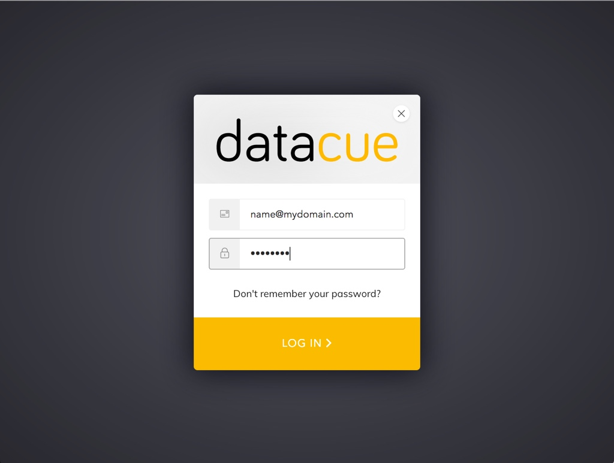

# Iniciar Sessão
Para acessar o dashboard, [clique aqui](https://app.datacue.co)

## Guia rápido
 - Use a barra lateral para acessar diferentes funcionalidades do DataCue.
 - Você pode alterar o idioma, de acordo com a sua preferência, entre Inglês, espanhol e português pelo rodapé.
 - Quando terminar, clique em "Sair" no canto superior direito do painel.

