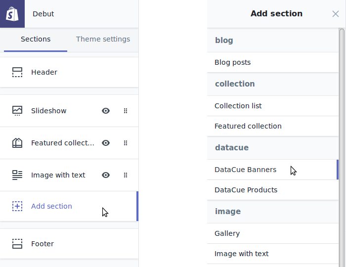

# Banners

Os banners são a parte mais importante da sua página inicial. Eles são normalmente exibidos imediatamente acima da dobra (a parte da página que normalmente requer que a rolagem seja vista) para atrair usuários para um grupo de produtos. Normalmente, estes poderiam ser:

- Categorias de produtos (por exemplo, jeans);
- Marcas de produtos.

Devido à sua capacidade de atrair a atenção, é muito importante mostrar banners relevantes para seus visitantes, em vez de mostrar a todos a mesma coisa.

## Guia Rápido

1. Vá para o editor de temas (`Home / Customize theme / Customize theme / Customize`).

   

2. Clique "Add section", então encontre a categoria "datacue" e selecione "DataCue Banners".

   

3. Selecione ou faça upload de um banner estático e vincule-o a algum lugar. Um banner estático é mostrado para todos os visitantes.

   

4. Arraste a seção recém-adicionada para onde você deseja que os banners apareçam. Recomendamos adicionar isso no topo do site, logo após sua barra de navegação.

5. Salve suas alterações e feche a configuração do Shopify!

6. Siga as instruções do [guia de banners do dashboard](/dashboard/banners.html) para escolher o layout desejado e carregar seus primeiros banners. Caso os layouts não te atendam, leia nosso guia sobre como criar seu próprio [layout personalizado](#custom-layout).

## Mudando seu banner estático

1. Vá para o editor de temas (`Home / Customize theme / Customize theme / Customize`).

   

2. Clique na seção Banners do DataCue

3.  Use o botão "select image" para fazer o upload de uma nova imagem, certifique-se de seguir as diretrizes de tamanho de uma proporção de 5: 3 (o tamanho recomendado é de 1200 x 720 px). Em seguida, insira um link para onde o usuário deve ir quando clicar no banner estático.

   