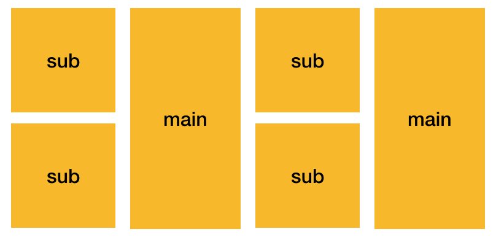
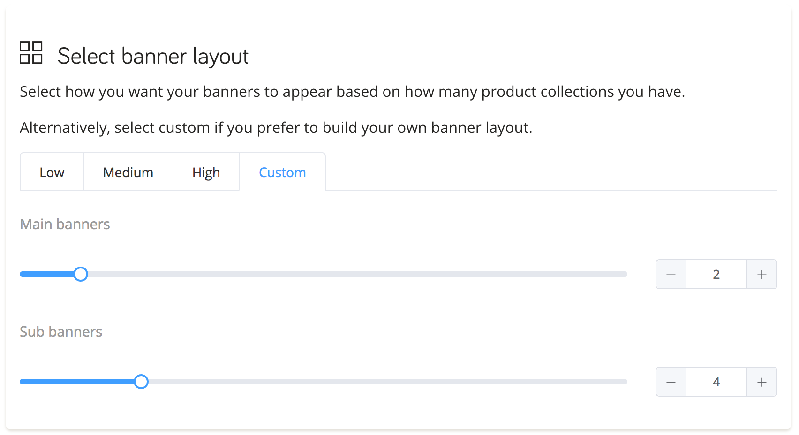

# Banners

Banners are the most prominent part of your home page. They are typically displayed immediately above the fold (the part of the page that typically requires scrolling to be seen) to attract users to a group of products. Typically these could be:

- Product categories (e.g. Jeans)
- Product brands.

Due to their ability to attract attention, it's very important to show relevant banners to your visitors instead of showing everybody the same thing.

## Quick Start

1. Go to the theme editor (`Home / Customize theme / Customize theme / Customize`).

   

2. Click "Add section", then find the "datacue" category and pick "DataCue Banners".

   

3. Pick or upload a static banner and make it link somewhere. A static banner is shown to every visitor.

   

4. Drag the newly added section to where you want the banners to appear. We recommend adding this at the top just after your navigation bar.

5. Save your changes and you're done with Shopify settings!

6. Follow the instructions in [the dashboard banners guide](/dashboard/banners.html) to pick the layout you want and upload your first banners. Alternatively, read our guide on building your own [custom layout](#custom-layout).

## Changing your static banner

1. Go to the theme editor (`Home / Customize theme / Customize theme / Customize`).

   

2. Click on the DataCue Banners section

3. Use the 'select image' button to upload a new image, ensure you follow the size guidelines of an aspect ratio of 5:3 (recommended size is 1200 x 720 px). Then enter a link for where the user should go to when they click on the static banner.

   

## Custom Layout

OK so you've looked at our banner layout designs, and you've got something fancier in mind. Fret not, we can totally take care of it. 

DataCue supports two banner sizes, lets call them main and sub. You can pick any size you want but they need to be consistent. For instance, lets say you want a layout like this:



This is what we mean by consistent: all the mains are the same size, and all the subs are the same size.

Lets implement the above design!

::: tip
If you think the above looks terrible, we're sorry. BUT... you're the one who decided not to use our beautiful standard layouts and build your own.
:::

So here's what you need to do:

1. Design your layout using a combination of two different sizes.

2. In the dashboard, go to banner settings (`Banners / Settings`)

3. Select `Custom` and select the number of main and sub banners you need. For the design above, we require 2 main and 2 sub banners.

  

4. Insert an HTML snippet like so, and style it with CSS as you like:

   ```html
   <div class="custom-banners">
     <div class="custom-static">
       <a href="https://example.com/any-link-you-want">
         
       </a>
     </div>
     <div class="custom-big" data-dc-main-insert-banner="1"></div>
     <div class="custom-big" data-dc-main-insert-banner="2"></div>
     <div class="custom-small" data-dc-sub-insert-banner="1"></div>
     <div class="custom-small" data-dc-sub-insert-banner="2"></div>
   </div>
   ```
  
   ```css
   .custom-banners {
     display: grid;
     grid-gap: 1em;
     grid-template-rows: 1fr auto;
     grid-template-columns:
       fit-content(calc(25% - 0.5em)) 1fr 1fr fit-content(calc(25% - 0.5em));
     grid-auto-flow: row dense;
   }

   .custom-banners a img { vertical-align: bottom; }

   .custom-static { grid-row: 1; grid-column: 2 / span 2; }

   .custom-big { grid-row: span 2; }
   ```

   The code above is just a basic example, but the idea is similar for any layout. You can use any class names you like on the `div` tags, they don't even have to be `div`s, you might have an existing structure you'd like to adapt. The only requirement is that you add the correct attribute name `data-dc-main-insert-banner` for main and `data-dc-sub-insert-banner` for sub. The numbers just tell us which order to insert the banners in. Something like put the 1st main banner here, put the 2nd main banner there.

   In case you're curious for more technical details. Our recommendations are sent as an array, see example below. The number refers to the index of the element in each array, starting with 1 instead of 0.

   ``` json
   {
     "main_banners": [
       { "link": "/collection/jeans", "photo_url": "jeans.jpg" },
       { "link": "/collection/tshirts", "photo_url": "tshirts.jpg" }
     ],
     "sub_banners": [
       { "link": "/collection/hats", "photo_url": "hats.jpg" },
       { "link": "/collection/shoes", "photo_url": "shoes.jpg" },
       { "link": "/collection/belts", "photo_url": "belts.jpg" },
       { "link": "/collection/chuck-norris","photo_url": "chuck-norris.jpg" }
     ]
   }
   ```

5. That's it!

In this way, we can deliver the right content to each user and you can build any kind of advanced layout you like.