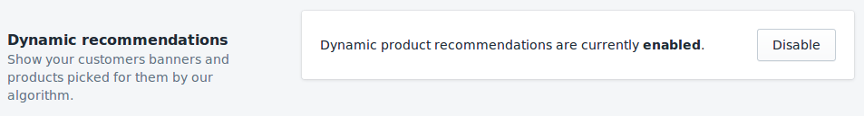

# Banners

Banners are the most prominent part of your home page. They are typically displayed immediately above the fold to attract users to a group of products. Typically these could be:

- Product categories (e.g. Jeans)
- Product brands

Due to their ability to attract attention, it's very important to show relevant banners to your visitors instead of showing everybody the same thing.

## Quick Start

1. Follow the instructions in [the dashboard banners guide](/dashboard/banners.html) to pick the layout and upload your first banners.

2. After you have the Shopify DataCue app installed, go to app settings and enable recommendations.

   

3. Go to the theme editor to add a new section.

4. Find the "datacue" category and pick "DataCue Banners".

5. Pick or upload a static banner, and make it link somewhere. This one will be shown to every visitor.

   

6. Drag the newly added section to where you want the banners to appear.

7. Save your changes and you're done!
