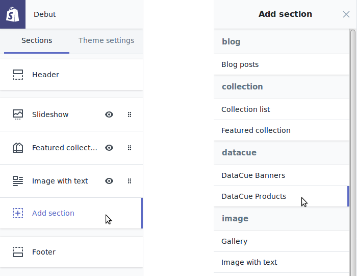
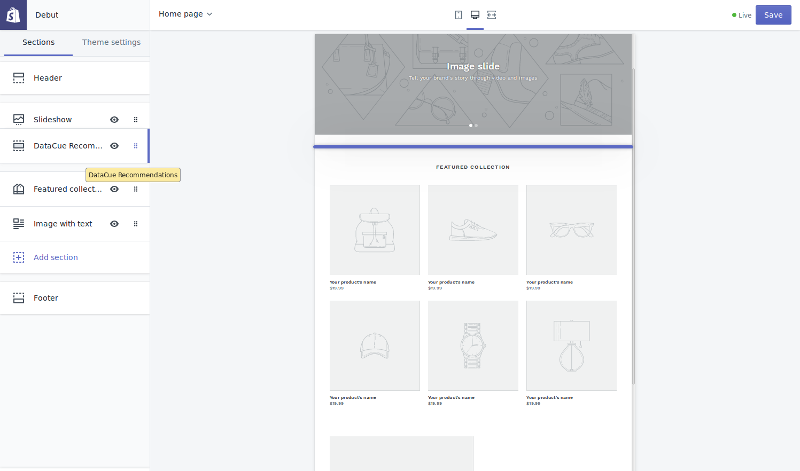

# Product carousels

DataCue offers three types of product recommendations:

- Related products
- Similar products
- Recently viewed

You can configure them on your dashboard.

## Quick Start

### Home page

1. Go to the theme editor (`Home / Customize theme / Customize theme / Customize`).

   

2. Click "Add section", then find the "datacue" category and pick "DataCue Products".

   

3. Drag the newly added section to where you want the carousels to appear.

   

4. Save your changes and you're done!

### Product page

Most themes don't allow adding custom sections to product pages, but there are some ways you can do it manually.

#### Method 1

If you're familiar with theme editing, you can find the product page template
(`templates/product.liquid`) in the code editor:


Then paste a special tag near the end of your template, where you want DataCue to insert the carousels:

```html
<div class="datacue-recommendations-anchor"></div>
```

#### Method 2

Alternatively, you can find a CSS class, given by your theme, for the product description section (as an example, the Turbo theme uses `.main.content`) and enter it in the dashboard.