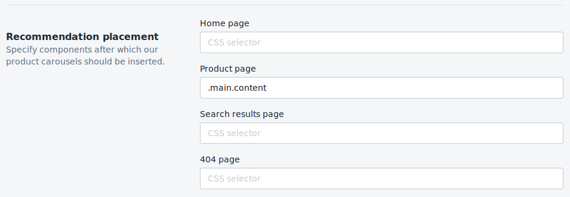

# Product carousels

DataCue offers three types of product recommendations:

- related products
- similar products
- recently viewed

You can configure them on your dashboard.

## Quick Start

### Home page

1. After you have the Shopify DataCue app installed, go to app settings and enable recommendations.

   

2. Go to the theme editor to add a new section.

3. Find the "datacue" category and pick "DataCue Recommendations".

4. Drag the newly added section to where you want the carousels to appear.

   

5. Save your changes and you're done!


### Product page

Most themes don't allow adding custom sections to product pages, but there are some ways you can do
it manually.

#### Method 1

If you're familiar with theme editing, you can find the product page template 
(`templates/product.liquid`) in the code editor:


Then paste a special tag near the end of your template, where you want DataCue
to insert the carousels:

```html
<div class="datacue-recommendations-anchor"></div>
```

#### Method 2

Alternatively, you can find a CSS class that your theme gives to the product description section
(as an example, the Turbo theme uses `.main.content`), and type that in the app settings, like this:



